# Agile software development

### Byron Georgantopoulos, GRNET

###14-Dec-2016, AUEB bootcamp

---

# Who are you?
* Introductions
* What is your background?
* Why are you here today?
(motivations, goals, questions, use post-its)

---

# Agenda

* Introduction 
* Why Agile 
* The Scrum framework 
* Common problems, experiences 
* Scaling Scrum 
* Kanban, XP, Lean 
* Certifications
* Outro

---

# Who am I?

* Studied computer science in DI/UoA
* MSc in Speech and Language Processing from the University of Edinburgh
* Software Developer
* Research Engineer
* e-Infra Project Manager
* Agile/Scrum enthousiast, PSM I certified
* @digibyron, linked.in/ibyron

---

# Have you ever head of Agile / Scrum?

---

# Introduction to project management

* the discipline of **initiating**, **planning**, **executing**, **controlling**, and **closing** the work of a **team** to achieve specific **goals** and meet specific **success** criteria
* several phases in a project
* several distinct roles

---

# Terminology

* PMI: Project Management Institute
* **Portfolio**: Projects, programs, and operations managed as a group to achieve strategic objectives
* **Program**: A group of projects and program activities managed in a coordinated way
* **Project**: Α temporary endeavor undertaken to create a unique product, service, or result

---

# Project phases
* Initiating - "Authorize the Work"
* Planning - "Plan the Work"
* Executing - "Work the Plan"
* Monitoring and controlling - "Control the Plan"
* Closing - "End the Work"

---

# Project artifacts
* Initiating - Project Charter, Stakeholder register
* Planning - Scope, Requirements, Cost, Quality, HR, Risk, ...
* Executing - Deliverables, Team Performance Assessments, Project Communications, Change Requests, ...
* Monitoring and controlling - Approved Change Requests, Cost Forecasts, Updates to Project Plan, Accepted Deliverables, ...
* Closing - Final Product, Closed Procurement

---

# Constraints

* The primary challenge of PM is to achieve all of the project goals within the given constraints

---

# Cost of errors

* The PMI approach places great emphasis on project initiation and planning when requirements are clearly defined and agreed upon and the full scope of the project is planned
* 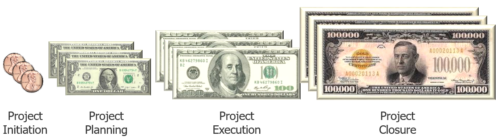

---
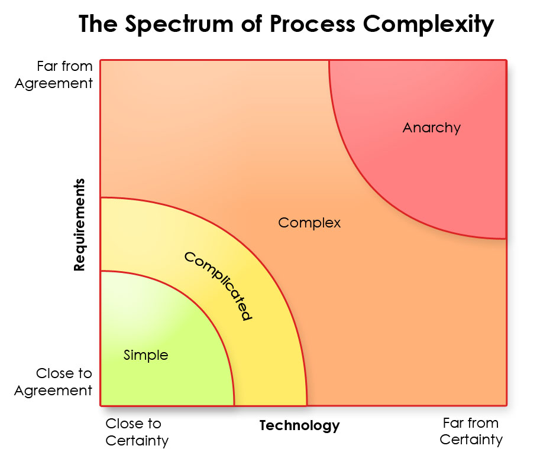
#####Source: *Strategic Management and Organizational Dynamics* by Ralph Stacey in *Agile Software Development with Scrum* by Ken Schwaber and Mike Beedle. 
---

# Complicated projects

* One axis is unknown
* Working with a new vendor on something
* Maybe big in effort or size
* But not “open-ended”
* Can be described in depth
* E.g.: build an aircraft

---

# Complex projects

* No upfront requirements definition
* Progressive discovery of project scope and dependencies
* *Known unknowns*; we know there are some things we do not know
* We may know the DB but not the size, or scaling factor
* Complex interactions between systems

---

# Top Reasons for Project Failure
* Incomplete Requirements
* Lack of user involvement
* Lack of Resources
* Unrealistic Expectations
* Lack of executive support

---

# Build the right product?
## Features used

* 20% often
* 30% infrequently
* 50% hardly ever/never

---

# Waterfall: Build the product right?
requirements =>
design =>
implementation =>
verification =>
maintenance 
 
---

# Early decisions hurt!

---

# Agile Manifesto - 2001

###We have come to value:
* Individuals and interactions over processes and tools
* Working software over comprehensive documentation
* Customer collaboration over contract negotiation
* Responding to change over following a plan

---

# Agile is an "umbrella"

* Various methodologies or frameworks implement agile
* Scrum (most popular)
* Kanban
* Lean
* In-house

---

# Waterfall vs. Agile

---

# Waterfall vs. Agile (2)
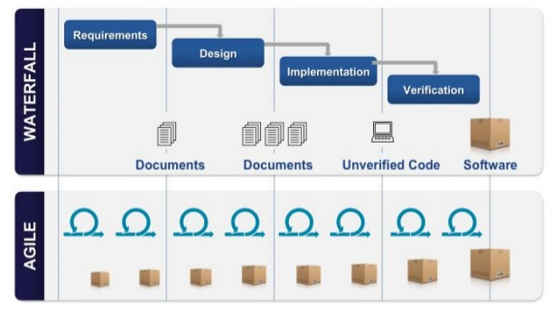
---

# Waterfile vs. Agile (3)
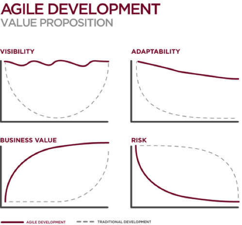

---

# Incremental development
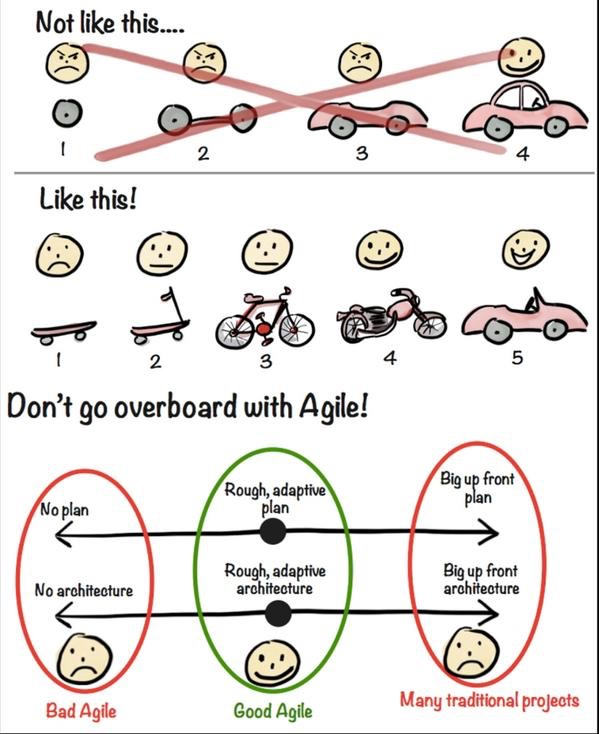
---

# Process Control Models

|  *Defined* | *Empirical* |
|---|---|
| **Predict the Future** | **Adapt to the future** |
| Initial information | Inspection |
|  Valid assumptions | Adaption |
| Change is managed | Transparency |
| **Examples** |  **Examples** |
|  Construction |  Sales |
|  Assembly Line | Creative writing |
|  Accounting |  Research |

*Situation Dictates Defined Or Empirical*
---

# Why Agile?
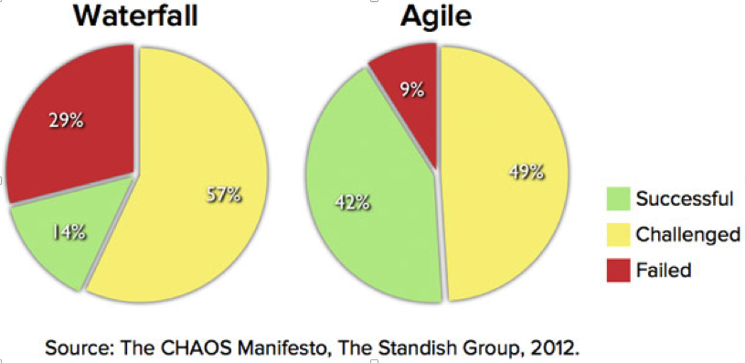

---

# Agile values & principles & lingo

* business value  
* time-boxed activities
* fruitful collaboration between customer & dev
* avoid up-front (waste)
* not command & control, but self-organization
* real working, done-done software
* inspect and adapt
* empirical

---

# Why Agile/Scrum

* Faster time-to-market
* Deliver maximum customer value
* Time-boxed iterations (sprints)
* Potentially shippable product at the end of each sprint
* Higher quality (only done stories)
* Early, continuous delivery, and improvement
* Self-organized teams that collectively ‘own’ the product
* Close co-operation between Dev team and Customer
* Responsive to change

---

# (VersionOne) state-of-Agile
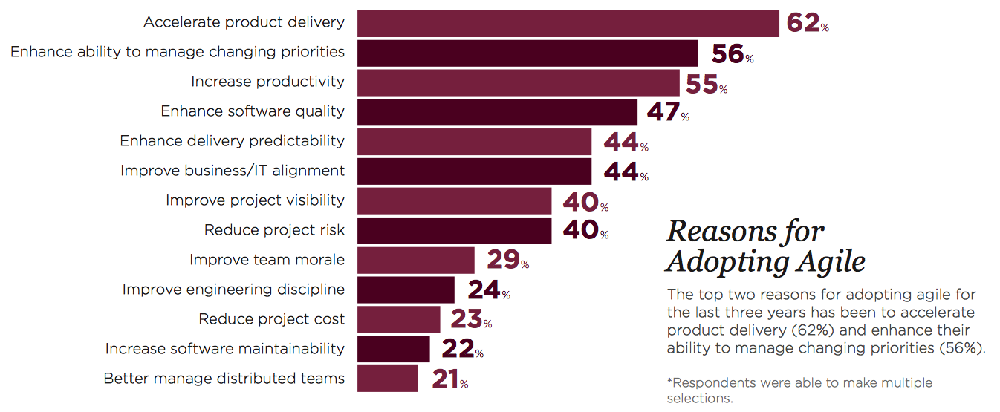
---

# When to consider Scrum

* What we’ve been doing no longer works
* We have experience, training, coaching
* Team trust
* Senior (but not only) devs
* Committed devs
* Better to start with a non-critical product
* Scrum is a mirror, not a solution
* Try ‘vanilla’ Scrum before attempting any variations

---

# Scrum in 100 words

* Scrum is an agile process that allows us to focus on delivering the highest **business value** in the **shortest** time. 
* It allows us to **rapidly** and **repeatedly** inspect actual working software (every two weeks to one month). 
* The business sets the priorities (product backlog). Teams **self-organize** to determine the best way to deliver the highest priority features. 
* Every two weeks to a month (**sprint**) anyone can see **real working software** and decide to release it as is or continue to enhance it for another sprint.

---

# …some more words

* Agile is a mentality, not an end-state
* Scrum is an implementation of Agile, a (lightweight) framework, not a methodology 
* Scrum guide is only 16 pages
* Simple to understand, difficult to master
* From Project to TEAM
* (early and continuous) Transparency
* MVP: Minimum Viable Product
* LRP: Last Responsible Moment

---

# Scrum is being used for

* Commercial software
* In-house development
* Contract development
* Fixed-price projects
* Financial applications
* Embedded systems
* 24x7 systems with 99.999% uptime requirements
* Video game development
* FDA-approved, life-critical systems
* Τhe Joint Strike Fighter
* Satellite-control software
* Websites
* Handheld software
* Mobile phones
* Network switching applications

---

# Scrum is being used by

* Google
* Microsoft
* Yahoo
* Spotify
* Electronic Arts
* Lockheed Martin
* Philips
* Siemens
* Nokia
* Intracom Telecom
* Ericsson
* European Dynamics
* Travelplanet24
* Skroutz.gr
* ΕΔΕΤ
* ...

---

# The Scrum Framework
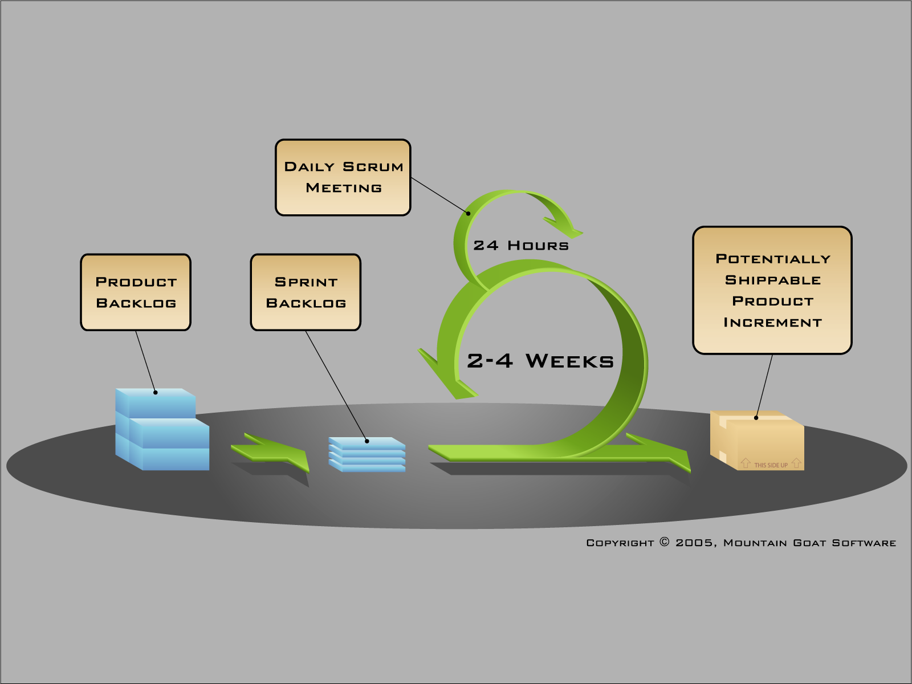
---

# Scrum: Roles, Ceremonies, Artifacts

---

# The development team

* Typically 5-9 people
* Cross-functional
* Programmers, testers, 
* UX designers, etc.
* Members should be full-time
* May be exceptions (e.g., database administrator) 

---

# The development team

* Self-organized
* Ideally co-located
* No special roles or titles

---

# Scrum Master

* Responsible for enacting Scrum values and practices
* Remove impediments for the team
* Ensure that the team is fully functional and productive
* Shield the team from external interferences

---

# Scrum Master

* Usually PMs graduate to SM role
* NOT a PM role
* But has to have an authority
* Enable close cooperation across all roles and functions
* Servant-leader model
* Act as a coach

---

# Product Owner

* Define the features of the product
* Decide on release date and content
* Be responsible for the profitability of the product (ROI)
* Prioritize features according to market value 
* Adjust features and priority every iteration, as needed  
* Accept or reject work results

---

# Product Owner

* Must be able to talk to all levels
* internally (own company)
* externally (contractor)
* Probably the most difficult to hire
* Must commit significant amount of time, day-to-day
* The sole responsible for the Product Backlog (of course interacts with stakeholders)

---

# Sprint planning

* Team selects items from the product backlog they can commit to completing
* Sprint backlog is created
* Stories, tasks are identified and each is estimated
* Collaboratively, not done alone by the Scrum Master
* High-level design is considered

---

# Stories estimation

* Notion of Story Points (SP)
* Refers to size/complexity, not to hours
* Team collectively does estimation
* Not the tech leader
* Not the most accustomed developer
* Estimation numbers vary between teams
* Story Points are used to compute team’s velocity and therefore serve as input to release planning

---

# Agile Planning

* Plans are nothing
* Planning is everything
* Planning is more important that the plan because once you start the project you will eventually find the plan is wrong and you have to update/adapt it

---

# Planning Poker

* Avoid trap/illusion of exact and linear estimation
* Fibonacci numbers to indicate size/complexity
* Each dev reveals estimation simultaneously
* Discrepancies explained, misunderstandings solved

---

# Sprint Planning Video

*  http://scrumtrainingseries.com/SprintPlanningMeeting/SprintPlanningMeeting.htm

---

# The daily scrum

* Parameters
* Daily
* 15-minutes
* Stand-up
* Same time and place
* Not for problem solving
* Whole world is invited
* Only team members, Scrum Master, Product Owner can talk
* Helps avoid other unnecessary meetings

---

# Everyone answers 3 questions

* These are not status for the Scrum Master
* They are commitments in front of peers

---

# Daily Scrum video

* scrumtrainingseries.com/DailyScrumMeeting/DailyScrumMeeting.htm

---

# The sprint review

* Team presents what it accomplished during the sprint
* Typically takes the form of a demo of new features or underlying architecture
* Informal
* 2-hour prep time rule
* No slides
* Whole team participates
* Invite the world

---

# The sprint review

* Not only the team, invite the world
* (In)formal opportunity to inspect the project
* Usually stakeholders and/or the team decide on new features, release, change directions

---

# Sprint retrospective

* Periodically take a look at what is and is not working (“Inspect and adapt”)
* Done after every sprint
* Whole team participates
* ScrumMaster
* Product owner
* Team
* Possibly customers and others

---

# Start / Stop / Continue Retrospective

### Just one way of doing retrospectives
## Whole team gathers and discusses what they’d like to:
* Start Doing
* Stop Doing
* Continue Doing

---

# Retrospective – Other formats
* What went well, what could have been improved, Actions
* Speedboat
* Starfish

---

# After the retrospective

* Try different formats frequently
* Should arrive at actionable items
* Retrospective decisions form a backlog
* Somebody has to "watch" it
* Otherwise members will render it useless and gradually get detached

---

# Product backlog

* The requirements / users / features
* A list of all desired work on the project
* Ideally expressed such that each item has value to the users or customers of the product 
* Prioritised by the Product Owner
* Reprioritized at the start of each sprint
* Transparent to anyone
* Living artifact 

---

# A sample product backlog
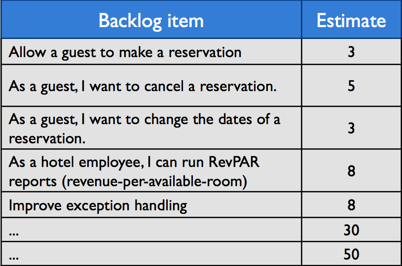
---

# Higher priority = More detailed

---

# User stories

* Syntax:
* As a **{role}** 
* I want to do **{action}** 
* so that **{result/value}**

* As a registered user I want to see my shopping cart so that I can check if an item’s price has dropped
* Stories must be user-oriented
* Technical stories may prevail in the beginning, but should be kept to minimum

---

# User stories

* Difficult to write (at least initially)
* Follow the INVEST model
* **I**ndependent: The user story should be self-contained, in a way that there is no inherent dependency on another user story.
* **N**egotiable: User stories, up until they are part of an iteration, can always be changed and rewritten.
* **V**aluable: A user story must deliver value to the end user.
* **E**stimable: You must always be able to estimate the size of a user story.
* **S**mall: User stories should not be so big as to become impossible to plan/task/prioritize with a certain level of certainty.
* **T**estable: The user story or its related description must provide the necessary information to make test development possible.

---

# Common Backlog Problems

* Disguised Detailed Requirements Specification
* Wish list for Santa
* Requirements Push (hand-off)
* Neglected garden
* Competing backlogs
* Action => Product backlog grooming/refinement

---

# Reading the burndown
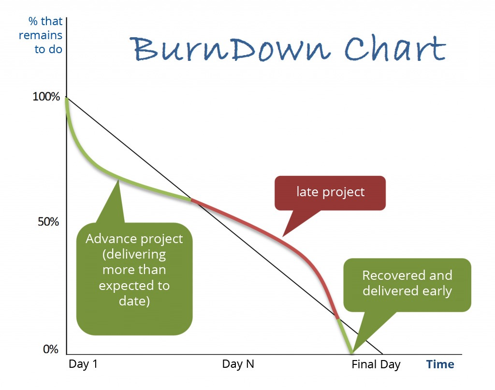
---

# Release burndown
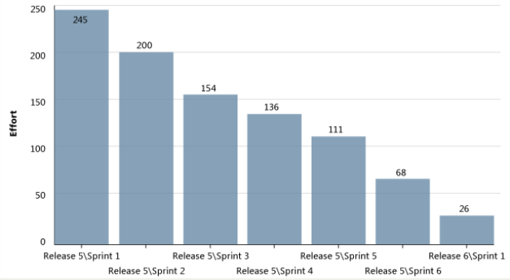
---

# Managing the sprint backlog

* Individuals sign up for work of their own choosing
* Work is never assigned
* Estimated work remaining is updated daily
* Sprint backlog cannot change during the sprint
* What about dependencies between tasks and stories?

---

# Taskboard – Sprint Start

---

# Short game - Balls

* Everyone has to touch each ball at least once. 
* Passing it to your neighbor at left or right hand side is not allowed.
* The person who touched the ball at the beginning has to touch it also at the end. Ball on the floor = no point.
* Timeboxed: 2 minutes preparation, X sprints of 2 minutes, 2 minutes retrospective.

---

# Software to run Scrum

* Don’t get over-excited with complicated software
* Trust physical boards 
* Information radiators, internally and externally
* Popular: 
	* Atlassian JIRA
	* Trello
	* Microsoft TFS
	* VersionOne
	* Spreadsheet (Excel, Google Docs) 

---

# Definition of Done (DoD)

* “Ready-to-ship” checklist 
* ~Applies to all PBIs
* Enhanced as the project progresses 
* Not having or not keeping DoD leads to 
* Insecurity, Stress, Overtime, Disappointment, Fights and TECHNICAL DEBT


---

# Definition of Done (DoD)

## Example
* feature coded
* feature reviewed by another member
* feature has %coverage in unit-tests
* feature is fully documented
* feature functional-tested
* feature pushed to code repo
* feature deployed to production


---

# Technical Debt

* The debt that builds up when you knowingly or unknowingly make wrong or non-optimal technical decisions
* Crappy design and code 
* “Copy-paste” code 
* “In my head” details 

---

# Technical Debt

* Can be found in: design, code, tests, deployment, documentation, …
* Can be measured using automated tools
* Friends: Deadlines, Overtime, Managers, “gurus”, …
* Enemies: Automated testing, pair programming, code review, ... 

---

# Lessons learned from a real Scrum project

* 14m project (Sep 14 - Oct 15)
* External developer team
* 7-8 members, mostly full-time
* 3 and then 2-week sprints

---

# Experience has taught me…

* From a GRNET project
* Common goals set when starting Scrum
* Common gains
* Common problems

---

# Why Scrum?

* Avoid common public project problems:
	* Transparency and control - ensure early & sustained visibility
	* Business risk minimization - able to modify the PB
* Test the Scrum waters
* How:
	* Short iterations
	* Potentially shippable increment at the end of every sprint
	* Prioritized PB items
	* Avoid upfront design, flexibiity to change scope when required
	* Frequent interaction and feedback

---

# Scrum adoption challenges

* Under-estimation
* Expect the managers to give orders
* 99% "Done" (activity vs. result-based)
* Silos of code
* Back-door waterfall attempts (e.g. request fully-fledged design)

---

# RFP preparation

* Very detailed initial specifications (“The system shall…”)
* Flat structure of specifications - not hierarchally organized
* Scrum explicitly stated as the implementation framework
* Scrum as a factor for scoring candidates (10%)

---

# Contract

* Scrum explicitly stated on contract
* Mid-to-Large duration (14m), although reduced from original
* Reporting on a monthly basis
* Payments based on reports (checkpoints) & features tested
* Fully estimated Product Backlog plus Definition-of-Done defined at the end of Pre-Game sprint
* Not finished SBIs re-inserted into next sprint
* Grooming to update and refine Product Backlog

---

# Glad :)

* Homogeneous team that 'gels' and works well together 
* Minimal interpersonal issues
* Close collaboration with PO (full collab 1d/week, initially  40-50% time devoted to the project so far)
* All ceremonies conducted and timeboxed
* Acceptance of Scrum, resistance less than expected

---

# Glad wrt. “Why Scrum” choices

* What the Project has gained from Scrum:
	* Demonstratable software
	* Deployable software
	* External stakeholders involvement
	* Continuous feedback 
	* Avoid wasted work and upfront design
	* Scope changes allowed

---

#  Sad :(

* Long-lasting tasks (frequently exceeding 2 days)
* 1st story always finishes late >> not smooth burndown
* Unfinished sprint stories >> unpredictable velocity
* Building technology skills vs. business value: 1-0 
* “Research project” instead of “Working software” mentality
* Increasing technical debt (coding standards, test coverage)
* Context switch & not full-time dedication
* PO => PO+SM+TechLead	

---

# Mad ~:(

* Delays and impediments surface towards the end of sprint, ignoring the 'elephant in the room'
* ‘Hero’ attitude: work overtime and finish everything at the end
* Status meetings masked into daily scrums 
* Definition-of-Done not followed 
* Insufficient transparency (infrequent commits, lack of meaningful comments, etc.)

---

# Scrum Anti-patterns

* Scrum Teams assigned to several projects or features. 
* Software not released to market frequently, thereby missing the opportunity for customer feedback.
* “Done” is not really “Done.” Need additional regression test cycles, or additional cycles to integrate work.
* >1 PO for one product with no clear accountability.
* Proxy PO are assigned to the team with no empowerment to make business decisions.
* Instead of recruiting someone experienced in Scrum, companies recruit someone with no prior Scrum experience or send their in-house PMs to a 2-day class.

---

# Scrum Anti-patterns

* The role of Scrum Master is undermined by assigning a part-time SM or team members taking turns.
* There is a myth that burn-down charts, burn-up charts, and cumulative-flow diagrams must be used as metrics. Scrum does not prescribe such metrics.
* Success cannot be measured by increasing velocity. It is a metric to measure capacity, not productivity.
* Sprints called {0, Design, Architectural, Hardening, Stabilization, Testing}. The only true Sprint is a time-box during which a “Done,” usable, and potentially releasable Product Increment is created.

---

# Scaling Scrum

* Typical individual team is 7 ± 2 people
* Scalability comes from teams of teams
* Factors in scaling
* Type of application
* Team size
* Team dispersion
* Project duration
* Scrum has been used on multiple 500+ person projects

---
# Scaling through the Scrum of Scrums

---

# The Nexus framework

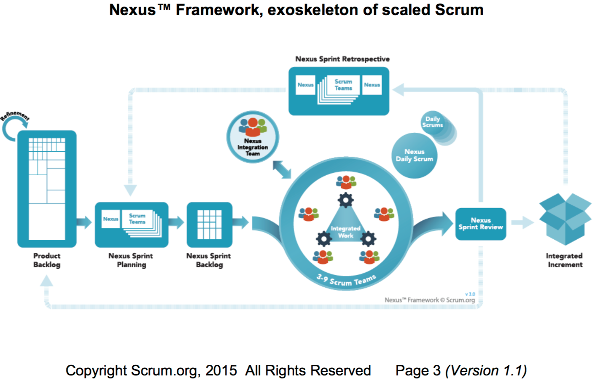

---

# The Nexus framework

* A new role: the Nexus Integration Team
	* consists of a Product Owner, a Scrum Master, and Nexus Integration Team Members.
* coordinate, coach, and supervise the application of Nexus.
* Focus on "dependencies" and "interoperation" between Scrum Teams.

---

# The Nexus framework

* Refine the Product Backlog: The PB needs to be decomposed so that **dependencies** are identified and removed or minimized.
* Nexus Sprint Planning: Appropriate **representatives** from each Scrum Team meet to discuss and review the refined PB
* Nexus Daily Scrum: Representatives from each Scrum Team meet daily to identify any **integration** issues.

---

# The Nexus framework

* Nexus Sprint Review: All teams meet with the PO to review the Integrated Increment. 
* Nexus Sprint Retrospective: Representatives from Scrum Teams meet to identify **shared** challenges. Then, individual Sprint Retrospectives follow. Representatives meet again to discuss actions based on shared challenges to provide **bottom-up intelligence**.

---

# Lean Software Development

* Adaptation of lean manufacturing (Toyota Production System) and lean IT principles and practices to the software development domain.
* Only produce necessary items in necessary amounts at necessary time

---

# Lean Software Development

## 7 principles
* Eliminate Waste
* Amplify learning
* Decide as late as possible
* Deliver as fast as possible
* Empower the team
* Build integrity in
* See the whole

---

# Kanban (Toyota, Japanese for Visual Card)

* Represents a more direct implementation of Lean principles, compared to traditional Agile methods. 
* With a consistent focus on **flow** and **context**, Kanban offers a less prescriptive approach to Agile. 
* Emphasis on **just-in-time** delivery while not overloading the team members. 
* The process, from definition of a task to its delivery, is **displayed** for participants to see and team members **pull work** from a **queue**.

---

# Kanban…in a nutshell

##Visualize the workflow
Split work into pieces, write each item on a card & put on the wall
Use named columns to illustrate where each item is in workflow
##Limit WIP (work in progress)
Assign explicit limits to how many items may be in progress at each workflow state. 
##Measure the lead time (average time to complete one item, sometimes called “cycle time”)
Optimize the process to make lead time as small and predictable as possible. 

---

# When should I consider Kanban? 

* Struggling with implementing Agile for a while without success? 
* Spending valuable time on Agile practices, which no longer seems to fit the context you are working in?
* Using Agile as a checklist without fully understanding the underlying principles?
* Need more flexibility than frozen, committed, planned iterations?
* Do your priorities shift on a daily basis?
* Using processes designed for Agile in a context where they are not an easy fit, e.g. maintenance and operations?
* Do you need a gradual transition from waterfall type execution to Agile in order to avoid high levels of organizational resistance?

---

# Kanban board
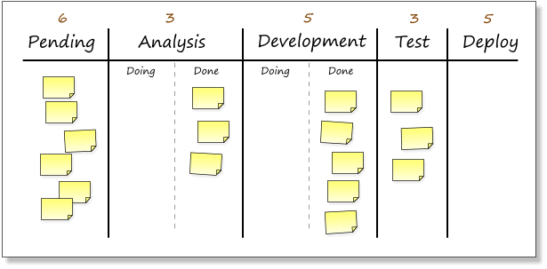

---

# Kanban vs. Scrum

##Similarities
* Both are Lean and Agile
* Both use pull scheduling
* Both limit WIP
* Both use transparency to drive process improvement
* Both focus on delivering releasable software early and often
* Both are based on self-organizing teams
* Both require breaking the work into pieces
* In both cases the release plan is continuously optimized based on empirical data (velocity / lead time)

---

# Kanban vs. Scrum
|  Scrum | Kanban |
|---|---|
|  Timeboxed iterations prescribed | Timeboxed iterations optional. Can have separate cadences for planning, release, process improvement. Can be event-driven instead of timeboxed |
|  Team commits to a specific amount of work for this iteration |  Commitment optional |
|  Cross-functional teams prescribed |  Cross-functional teams optional. Specialist teams allowed |
| Items must be broken down so they can be completed within 1 sprint | No particular item size is prescribed |
| Burndown chart prescribed |  No particular type of diagram is prescribed |
| WIP limited indirectly (per sprint) |  WIP limited directly (per workflow state) |
---

# Kanban vs. Scrum
|  Scrum | Kanban |
|---|---|
|  Estimation prescribed | Estimation optional |
|  Cannot add items to ongoing iteration |  Commitment optional |
|  A sprint backlog is owned by one specific team | A kanban board may be shared by multiple teams or individuals |
| Prescribes 3 roles (PO/SM/Team) | No roles prescribed |
| A Scrum board is reset between each sprint | A kanban board is persistent |
| Prescribes a prioritized product backlog) | Prioritization is optional |

---

# XP (eXtreme Programming)

* Extreme programming (XP) is a software development methodology which is intended to improve software quality and responsiveness to changing customer requirements. 
* As a type of agile software development, it advocates frequent "releases" in short development cycles, to improve productivity and introduce checkpoints at which new customer requirements can be adopted.

---

# XP and Scrum

## XP practices pair well with Scrum 
* Code reviews 
* Pair programming 
* Test-driven-development 
* Continuous integration 
* Frequent refactoring 
* Collective code ownership
* Automated Testing (especially regression)
 
---

# Steps to Scrum Adoption

* Start small, with a pilot, a non-critical project
* Ensure executive support
* Train your team
* Coach your team
* Spread the word, and then scale

---

# Agile Coach

* Not a consultant
* Experienced Agile/Scrum practitioner
* Propose (not impose) best practices
* Train, guide, mentor

---

# Certifications & Training

* Many flavors to choose from
* Lots of chance for training 
* F2F training: rare in Greece

---

# SCRUM ALLIANCE

##CERTIFIED SCRUM MASTER
* Prerequisites: Attendance of a CMS course by a certified Scrum Alliance partner
* Cost: Included in seminar cost, which is rather pricey
* Certification test type: Online
* Passing score: 24/35 Questions (69%)
* Duration: No time limit
* Considered very easy
* More of a 'certificate of attendance'

---

# SCRUM.ORG

##PROFESSIONAL SCRUM MASTER I
* Prerequisites: None (sample online tests on the site)
* Cost: 150$
* Certification test type: Online
* Passing score: 68/80 Questions (85%)
* Duration: 1 hour
* Considered difficult to obtain, requires above than standard knowledge

---

# PMI

##Agile Certified Practicioner (ACP)
* Follows PMP model
* Prerequisites: Working experience, multi-hour examinations
* Considered "traditional" (waterfall) Project Management advocate

---

# Let's do some test(s)!

* https://www.scrum.org/Assessments/Open-Assessments
* https://scrumstar.com/exam

---

# Links

* scrum.org 
* Scrum Alliance
* http://www.scrumalliance.org
* Agile Greece meetup
* http://www.meetup.com/Agile-Greece/ 
* Mountain Goat Software
* www.mountaingoatsoftware.com/scrum

---

# Selected Reading

*  *The Scrum guide* http://www.scrumguides.org/scrum-guide.html
*  *Scrum and XP from the Trenches* by Henrik Kniberg 
*  *Agile and Iterative Development: A Manager’s Guide* by Craig Larman
*  *Agile Estimating and Planning* by Mike Cohn
*  *Agile Project Management with Scrum* by Ken Schwaber
*  *Agile Retrospectives* by Esther Derby and Diana Larsen

---

# Selected Reading

* *Agile Software Development Ecosystems* by Jim Highsmith
* *Agile Software Development with Scrum* by Ken Schwaber and Mike Beedle 
* *Scrum and The Enterprise* by Ken Schwaber
* *Succeeding with Agile* by Mike Cohn
* *User Stories Applied* for Agile Software Development by Mike Cohn

---

# Famous last words

* Q&A

* Discuss your morning post-its

* Evaluate me

* Thank you!

