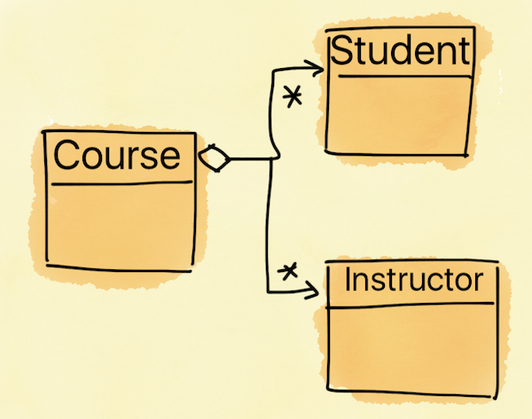

##Quick Recap - Principles of Object-orientation
* Abstraction
* Encapsulation
* Modularization
* Hierarchy


##Design Patterns - A Motivating Example
<ul class="fragment">
<li>Bootcamp course and a few stakeholders (Students and Instructors)</li>
<li>Any change in the course must be notified to all the stakeholders</li>
<li class="fragment">Now, think about its implementation
</li></ul>


##Design Patterns - A Motivating Example



##Implementation
```java
public class Course {
private Student student;
private Instructor instructor;
	public Course() {
		student = new Student();
		instructor = new Instructor();
	}
	public void update() {
		student.update();
		instructor.update();	
	}
}
```


##Implementation - Cont.
<ul>
<li>Course class is "tightly-coupled" to Student and Instructor classes.</li>
<li class="fragment">Is it easy to add a new observer (a new Student or a new Instructor)?
<ul><li>You need to make multiple changes</li>
<li class="fragment">What about adding a new category of observers; for example "Organizers"!</li>
</ul></ul>
