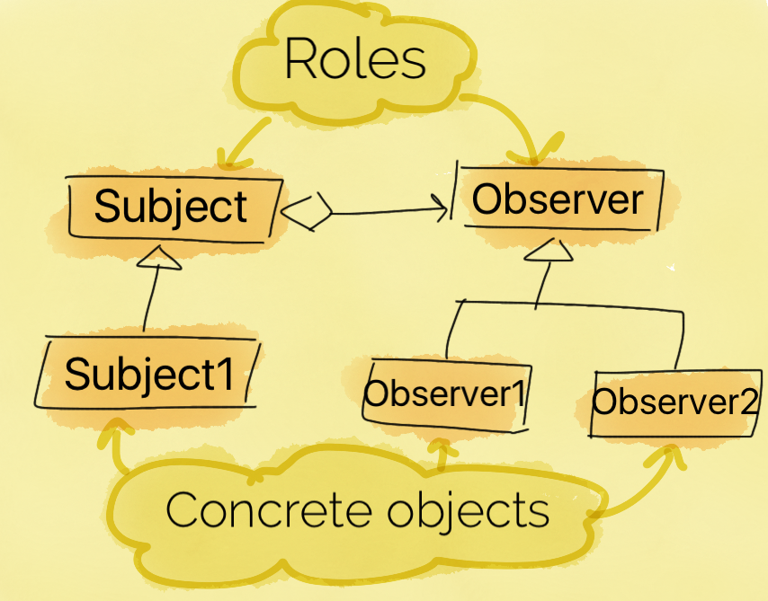
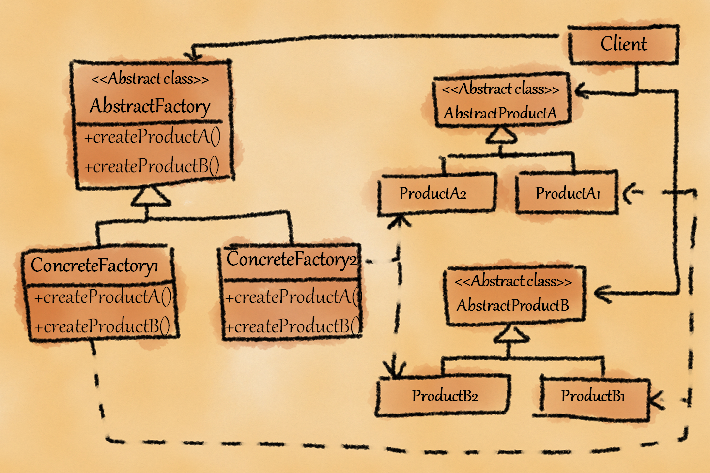
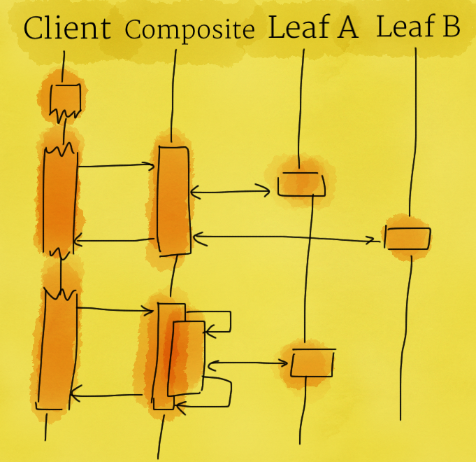
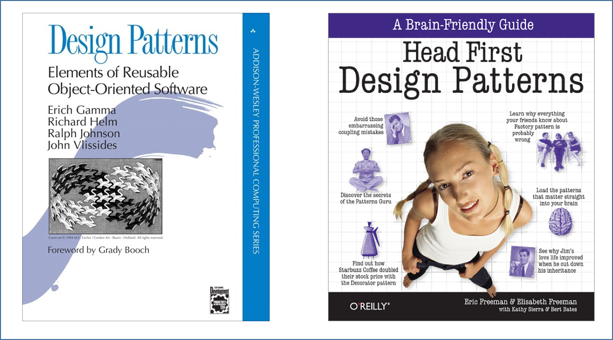

##Who Am I?


##Quick Recap - Principles of Object-orientation
* Abstraction
* Encapsulation
* Modularization
* Hierarchy


##Principles of Object-orientation
* <b>Abstraction</b> - Simplify entities via
  * Reduction of unnecessary details
  * Generalization of common and important aspects


##Principles of Object-orientation
* <b>Encapsulation</b> - Separation of concerns and information hiding via
  * Hiding implementation details
  * Hiding variations


##Principles of Object-orientation
* <b>Modularization</b> - Cohesive and loosely-coupled abstractions via
  * Localization
  * Decomposition


##Principles of Object-orientation
* <b>Hierarchy</b> - Hierarchical organization of abstractions via
  * Classification and ordering
  * Generalization and factoring


##Design Patterns - A Motivating Example
<ul class="fragment">
<li>Bootcamp course and a few stakeholders (Students and Instructors)</li>
<li>Any change in the course must be notified to all the stakeholders</li>
<li class="fragment">Now, think about its implementation
</li></ul>


##Design Patterns - A Motivating Example


##Implementation
```java
public class Course {

    private Student student;
    private Instructor instructor;

	public Course() {
		student = new Student();
		instructor = new Instructor();
	}
	private void updateAll() {
		student.update();
		instructor.update();	
	}
	public void changeTime() {
		//change time
		updateAll();
	}
}
```
```java
public class Program {

	public static void main(String[] args) {
		Course course = new Course();
		course.changeTime();
	}
}
```


##Implementation - Cont.
<ul>
<li>Is it easy to add a new observer (a new Student or a new Instructor)?
<ul><li class="fragment">You need to make multiple changes</li>
<li class="fragment">What about adding a new category of observers; for example "Organizer"!</li>
</ul></ul>


##Implementation - Take 2
```java
public class Program {

	public static void main(String[] args) {
		Student student = new Student();
		Instructor instructor = new Instructor();
		Organizer organizer = new Organizer();
		
		Course course = new Course();
		course.addObserver(student);
		course.addObserver(organizer);
		course.addObserver(instructor);
		
		course.changeTime();
	}
}
```


##Implementation - Take 2
```java
import java.util.Observable;

public class Course extends Observable {

	public void changeTime() {
		//change time
		setChanged(); // obligatory before notifying observers
		notifyObservers();
	}
}
```
```java
import java.util.Observable;

public class Student implements Observer {

	@Override
	public void update(Observable o, Object arg) {

	}
}
```


##A Motivating Example
* Now, think again about adding new observers.
* Is it easier?


##A Motivating Example
<ul>
<li>Yes? WHY?</li>
<li class="fragment">In the first implementation, `Course` class is "tightly-coupled" to `Student` and `Instructor` classes. While in the second case, `Course` class is "loosely-coupled" to it's observers.</li>
<br>
<li class="fragment">Congratulations!! You have just learned the first design pattern :)</li>
</ul>


##The Implemented Solution


##Observer Design Pattern



##Observable and Observer (in Java)


##What About .NET
* IObservable interface
* IObserver interface


##Let Us Define Design Patterns
* <i>Design patterns are descriptions of communicating objects and classes that are customized to solve a general design problem in a particular context. (By Gang of Four)</i>
<br>
<br>
* <i>Design patterns are solutions to commonly occurring design problems.</i>


##Essential Elements of Patterns
<ul>
<li>Name</li>
<br>
<li class="fragment">
Problem
</li>
<ul class="fragment">
<li>
Problem and context</li></ul>
<br>
<li class="fragment">
Solution</li>
<ul  class="fragment">
<li>
Relationships, roles, and responsibilities</li></ul>
<br>
<li class="fragment">
Consequences</li>
<ul class="fragment">
<li>Benefits and liabilities</li>
<li>Tradeoffs</li>
</ul>
</ul>


##Why to Use Patterns
<ul>
<li class="fragment">
Higher design quality </li>
<ul class="fragment">
<li>Flexibility</li>
<li>Changeability</li>
<li>Testability</li>
<li>...</li>
</ul>
<br>
<li class="fragment">Common vocabulary</li>
</ul>


##Categories of Patterns
<ul>
<li><b>Creational</b> - patterns answer how to create and when to create</li>
<ul>
<li>Examples: Factory, Abstract Factory, Builder</li></ul>
<br>

<li class="fragment"><b>Structural</b> - patterns answer how to compose/structure</li>
<ul>
<li class="fragment">Examples: Adapter, Composite, Decorator</li></ul>
<br>
<li class="fragment"><b>Behavioral</b> - patterns describe how a group of objects cooperate to carry out a task</li>
<ul>
<li class="fragment">Examples: Observer, Strategy, Visitor</li></ul>
</ul>


##Exercise 1
* In the context of bootcamp course, there is a course, students, instructors, and organizers.
* The course has a start time and end time.
* If any of the timing changes, the stakeholders have to be notified.

Implement a program that notifies the stakeholders whenever the time changes for the course.


##Exercise 2
* Write a utility class for reading a text file and writing to a text file.


##Exercise 3
* Write a program to compute following metrics for a C# (or Java) code: 
  * LOC (Lines of Code)
  * Number of classes
  * Number of methods 
  
Use regular expressions to achieve that.


##Factory Pattern
* <b>Motivation</b>
  * Creating objects without exposing the instantiation logic to the clients
  * Providing a common interface to refer all objects (of a kind)


##Factory Pattern


##Factory Pattern Example


##Factory Pattern
<ul>
<li><b>Benefits</b></li>
<ul>
<li>Separation of concerns - the logic to instantiate is separated</li>
<li>Flexibility - to extend Product hierarchy without affecting clients</li>
</ul>
  
<br>

<li class="fragment"><b>Liabilities</b></li>
<ul>
<li class="fragment">Don't bypass</li></ul></ul>


##Let us extend the Factory Pattern
* <b>Motivation</b>
  * Let us assume you have <u><i>families of objects</i></u> to instantiate
  
  <br>
  * Widget library providing UI elements such as Button and TextBox
  * The library instantiate UI elements based on the platform such as Windows and Linux


##Abstract Factory Pattern



##Abstract Factory Pattern
<ul>
<li><b>Benefits</b></li>
<ul>
<li>Flexibility (Entire product families can be easily exchanged)
</li>
<li>Separation of concerns (Object lifetime management is separated from object use)</li></ul>

<br>
<li class="fragment"><b>Liabilities</b></li>
<ul>
<li class="fragment">GoF Abstract Factory only covers object creation, not object disposal</li>
</ul>
</ul>


##Strategy Pattern
* <b>Motivation</b>
  * Support for more than one algorithm required in many situations:
    * Clients do not want to be dependent on a supplied default algorithm
    * Suitability of an algorithm may change based on the context (input, platform, ...)
    * Integrating new algorithms should be easy (without modifying existing code, if possible)

<br>

* Examples - compression algorithm, sort algorithm


##Strategy Pattern


##Strategy Pattern
<ul>
<li><b>Benefits</b></li>
<ul>
<li>Freedom to choose algorithms
</li>
<li>Easier extensibility</li></ul>

</ul>


##Strategy Pattern
* <b>Applicability</b>
  * Many related classes differ only in their behavior
  * You need different variants of an algorithm
  * A class defines many behaviors, and these appear as multiple conditional statements in its operations
  


##Composite Pattern


##Composite Pattern
<b>Motivation</b>
* Need to represent "whole-part" hierarchies with following requirements
  * Preserve hierarchical structure
  * Same interface for both compound or atomic objects for clients 
  * It should be easy to extend the hierarchy with new element types


##Composite Pattern


##Composite Pattern



##Composite Pattern
* <b>Benefits</b>
  * Transparency (Clients are shielded from the object hierarchy)
  * Extensibility (New leafs are easy to add)


##Façade Pattern
* <b>Motivation</b>
  * Let us assume that we have a component that provide complex multi-steps services
  * How to provide a client simplified access to the functionality of such a component


##Façade Pattern


##Façade Pattern
* Create a façade class that provides a high-level unified interface which contains functions commonly-accessed by the clients
* The client can invoke functions in the façade class which will in turn invoke the specialized functionality in the system
* This makes it very simple for the client to invoke functionality without knowing the innards of the system
* However, the client can always directly access a sub-system for specific services


##Façade Pattern
* <b>Benefits</b>
  * Provides a simple interface to a complex system
  * De-couples the subsystem for clients and other subsystems, thereby promoting subsystem independence and portability
  * Layers the subsystem
    * Use façade to define an entry point to each subsystem level
    * If subsystems are dependent, then the dependencies between them can be simplified by making them communicate with each other solely through their facades


##References



##Exercises
<ol start="4">
<li> Complete exercise 1, 2, and 3
</li>
<li>Provide another way to implement the same functionality but by using string comparison. Pay attention to your design (hint: implement strategy and factory paterns)</li>
<li>Extend the above program and implement a segregated interface to compute all the supported metrics. Write all the computed metrics to a CSV file. (hint: use Facade pattern)</li></ol>
