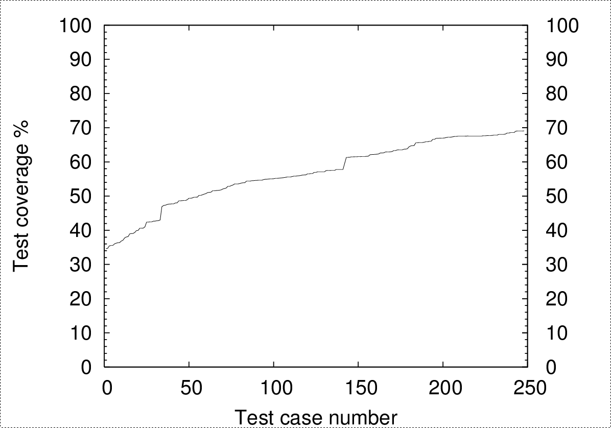
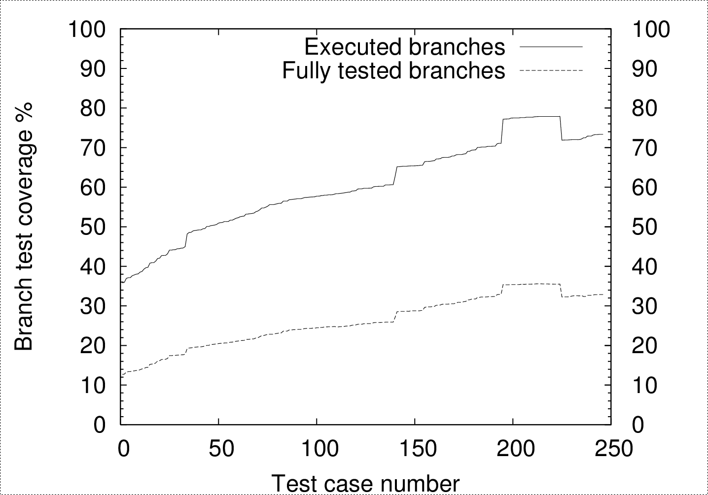

# Definition
*Dynamic* verification that the program has the
*expected* behevior
in a suitably *selected* *final* set of test cases

(Others also consider static analysis as a testing activity.)


## Terminology
* Verification: Are we correctly implementing the software?
* Validation: Are we implementing the right software?
* A *fault* leads to a
* *failure*


## Levels of testing
* Unit Testing
* Component Testing
* Integration Testing
* System Testing
* Acceptance Testing
* Alpha Testing
* Beta Testing


## Testing by goal
* Acceptance testing
* Installation testing
* Alpha/beta testing
* Regression testing
* Performance testing
* Stress testing
* Recovery testing
* Interface testing
* Configuration testing
* Usability testing


## Useful testing techniques
* Ad hoc
* Exploratory
* Extreme values
* Random values
* Cover control paths
* Cover data paths
* Guess probably mistakes


## Useful testing data
* Fault history
* Fault categories
* Ratio of faults to code volume
* This can be used to
  * Determine reliability from failures
  * Finish testing based on assumed reliability


## Judging testing progress
* Based on test coverage
* Based on finding injected faults


## Testing practices
* Testing succeeds when it finds faults
* Establish test process and guidelines
* Documentation
* Test-driven development (TDD)
* Internal or through external team
* Integration based on risk analysis


## Testing activities
* Test plan
* Test cases
* Testing environment
* Test execution
* Test result evaluation
* Issue reporting
* Issue management


## Testing tools
* Test harnesses
* Test generators
* Fuzzers
* Record and replay tools
* Difference analyzers
* Testing frameworks
* Test coverage analyzers
* Unit test execution frameworks
* Static analyzers
* Regression testers
* Tracing tools
* Stress generators


## Example: Test coverage analysis with gcov
```
      1    if (*++argv && !strcmp(*argv, "-n")) {
 ######            ++argv;
 ######            nflag = 1;
           }
           else
      1            nflag = 0;
      3    while (*argv) {
      2            (void)printf("%s", *argv);
      2            if (*++argv)
      1                    putchar(' ');
           }
      1    if (!nflag)
      1            putchar('\n');
      1    exit(0);
```


## Example: Statement coverage (Perl)



## Example: Branch coverage (Perl)

