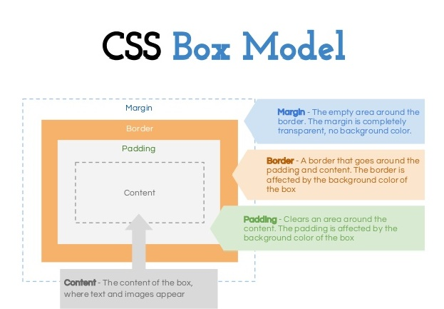

## CSS
Cascading Style Sheets (CSS) are a stylesheet language used to describe the presentation of a document written in HTML or XML (including XML dialects like SVG or XHTML).

CSS describes how elements should be rendered on screen, on paper, in speech, or on other media.


## Applying CSS
There are three ways to apply CSS to HTML:
1. Inline
2. Internal
3. External


## Inline CSS
Inline styles are plonked straight into the HTML tags using the style attribute.

They look something like this:
```html
<p style="color: red">text</p>
```
This will make that specific paragraph red.


## Inline CSS
But, if you remember, the best-practice approach is that the HTML should be a stand-alone, presentation free document, and so inline styles *should be avoided* wherever possible.


## Internal CSS
Embedded, or internal, styles are used for the whole page. Inside the head element, the style tags surround all of the styles for the page.
```html
<!DOCTYPE html>
<html>
<head>
<title>CSS Example</title>
<style>
    p {
        color: red;
    }
    a {
        color: blue;
    }
</style>
```
This will make all of the paragraphs in the page red and all of the links blue.


## Internal CSS
Although preferable to soiling our HTML with inline presentation, it is similarly usually preferable to keep the HTML and the CSS files separate, and so we are left with our savior...


## External CSS
External styles are used for the whole, multiple-page website. There is a separate CSS file, which will simply look something like:
```css
p {
  color: red;
}
a {
  color: blue;
}
```
If this file is saved as "style.css" in the same directory as your HTML page then it can be linked to in the HTML like this:
```html
<!DOCTYPE html>
<html>
<head>
    <title>CSS Example</title>
    <link rel="stylesheet" href="style.css">
```


## CSS Syntax
A CSS rule-set consists of a selector and a declaration block:

* The selector points to the HTML element you want to style.
* The declaration block contains one or more declarations separated by semicolons.
* Each declaration includes a CSS property name and a value, separated by a colon.


## CSS Selectors - 1/2


## CSS Selectors - 2/2


## Lengths and Percentages
There are many property-specific units for values used in CSS, but there are some general units that are used by a number of properties and it is worth familiarizing yourself:

* `px` (such as font-size: 12px) is the unit for pixels.
* `em` (such as font-size: 2em) is the unit for the calculated size of a font. So “2em”, for example, is two times the current font size.
* `pt` (such as font-size: 12pt) is the unit for points, for measurements typically in printed media.
* `%` (such as width: 80%) is the unit for percentages.


## Layout


## CSS Box Model
All HTML elements can be considered as boxes. In CSS, the term "box model" is used when talking about design and layout.

