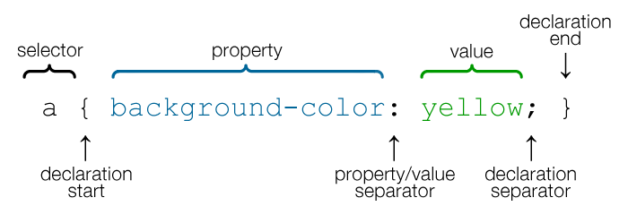
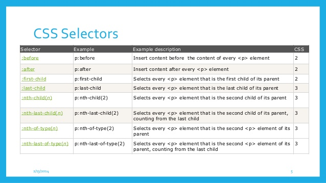

## CSS
Cascading Style Sheets (CSS) are a stylesheet language used to describe the presentation of a document written in HTML or XML (including XML dialects like SVG or XHTML).

CSS describes how elements should be rendered on screen, on paper, in speech, or on other media.


## Applying CSS
There are three ways to apply CSS to HTML:
1. Inline
2. Internal
3. External


## Inline CSS
Inline styles are plonked straight into the HTML tags using the style attribute.

They look something like this:
```html
<p style="color: red">text</p>
```
This will make that specific paragraph red.


## Inline CSS
But, if you remember, the best-practice approach is that the HTML should be a stand-alone, presentation free document, and so inline styles *should be avoided* wherever possible.


## Internal CSS
Embedded, or internal, styles are used for the whole page. Inside the head element, the style tags surround all of the styles for the page.
```html
<!DOCTYPE html>
<html>
<head>
<title>CSS Example</title>
<style>
    p {
        color: red;
    }
    a {
        color: blue;
    }
</style>
```
This will make all of the paragraphs in the page red and all of the links blue.


## Internal CSS
Although preferable to soiling our HTML with inline presentation, it is similarly usually preferable to keep the HTML and the CSS files separate, and so we are left with our savior...


## External CSS
External styles are used for the whole, multiple-page website. There is a separate CSS file, which will simply look something like:
```css
p {
  color: red;
}
a {
  color: blue;
}
```
If this file is saved as "style.css" in the same directory as your HTML page then it can be linked to in the HTML like this:
```html
<!DOCTYPE html>
<html>
<head>
    <title>CSS Example</title>
    <link rel="stylesheet" href="style.css">
```


## CSS Syntax
A CSS rule-set consists of a selector and a declaration block:

* The selector points to the HTML element you want to style.
* The declaration block contains one or more declarations separated by semicolons.
* Each declaration includes a CSS property name and a value, separated by a colon.


## CSS Selectors - 1/2


## CSS Selectors - 2/3



## CSS Selectiors - 3/3


## Lengths and Percentages
There are many property-specific units for values used in CSS, but there are some general units that are used by a number of properties and it is worth familiarizing yourself:

* `px` (such as font-size: 12px) is the unit for pixels.
* `em` (such as font-size: 2em) is the unit for the calculated size of a font. So “2em”, for example, is two times the current font size.
* `pt` (such as font-size: 12pt) is the unit for points, for measurements typically in printed media.
* `%` (such as width: 80%) is the unit for percentages.


## Layout


## CSS Box Model
All HTML elements can be considered as boxes. In CSS, the term "box model" is used.


## Content area
The content area is the area containing the real content of the element. Its dimensions are the *content width*, or content-box width, and the *content height*, or content-box height.

If the CSS `box-sizing` property is set to default, the CSS properties `width`, `min-width`, `max-width`, `height`, `min-height` and `max-height` control the content size.


## Padding area
The padding area extends to the border surrounding the padding. When the content area has a background, color, or image set on it, this will extend into the padding, which is why you can think of the padding as extending the content.

The space between the padding and the content edge can be controlled using the `padding-top`, `padding-right`, `padding-bottom`, `padding-left` and the shorthand `padding` CSS properties.


## Border area
The border area extends the padding area to the area containing the borders. This area depends on the size of the border that is defined by the `border-width` property.

The `border` property is a shorthand property for the following individual border properties:

`border-width`,  `border-style`,  `border-color`
```css
  p { border: 5px solid red; }
```

You can also specify border properties for just one side:

```css
  p { border-left: 6px solid red; }
```


## Margin area
The margin area extends the border area with an empty area used to separate the element from its neighbors.

The size of the margin area is controlled using the `margin-top`, `margin-right`, `margin-bottom`, `margin-left` and the shorthand `margin` CSS properties.


## `display` property
The `display` property is the most important CSS property for controlling layout.

The `display` property specifies if/how an element is displayed.

Every HTML element has a default display value depending on what type of element it is. The default display value for most elements is __block__ or __inline__.


## `display: none`
Turns off the display of an element (it has no effect on layout); all descendant elements also have their display turned off. The document is rendered as though the element did not exist.

To render an element box's dimensions, yet have its contents be invisible, use the `visibility: false` property.


## `display: block`
A block-level element always starts on a new line and takes up the full width available (stretches out to the left and right as far as it can).

Examples of block-level elements:
`<div>`, `<h1> - <h6>`, `<p>`, `<form>`, `<header>`, `<footer>`, `<section>`


## `display: inline`
An inline element does not start on a new line and only takes up as much width as necessary. You cannot set the width and height of an inline element.

Examples of inline elements: `<span>`, `<a>`, ``


## `display: inline-block`
The `inline-block` combines the properties of both block elements and inline elements. You get the ability to set a height and width, and the element can appear on the same horizontal line as other elements.


## 


## `display: flex`
The `Flexbox Layout` module aims at providing a more efficient way to lay out, align and distribute space among items in a container, even when their size is unknown and/or dynamic (thus the word "flex").

The Flexbox Layout is direction-agnostic as opposed to the regular layouts (block which is vertically-based and inline which is horizontally-based). While those work well for pages, they lack flexibility to support large or complex applications, especially when it comes to orientation changing, resizing, stretching, shrinking, etc.

[Read about Flexbox Layout](https://css-tricks.com/snippets/css/a-guide-to-flexbox/)


## `display: grid`
`CSS Grid Layout` (aka `Grid`), is a two-dimensional grid-based layout system that aims to do nothing less than completely change the way we design grid-based user interfaces.

It's currently a W3C Working Draft and isn't supported correctly in any browsers yet by default. Internet Explorer 10 and 11 support it, but it's an old implementation with an outdated syntax. In order to experiment with Grid today, use Chrome, Opera or Firefox with special flags enabled.

[Read about Grid (not needed for bootcamp)](https://css-tricks.com/snippets/css/complete-guide-grid/)


## Aligning outside of flex
### Center align elements
To horizontally center a block element (like `<div>`), use `margin: auto`;

Setting the width of the element will prevent it from stretching out to the edges of its container.

The element will then take up the specified width, and the remaining space will be split equally between the two margins


## Aligning outside of flex
### Center align text
To just center the text inside an element, use `text-align: center`
```css
.center {
  text-align: center;
}
```


## Aligning outside of flex
### Center align image
To center an image, use `margin: auto` and make it into a block element:
```css
img {
    display: block;
    margin: auto;
    width: 40%;
}
```


## Colors
CSS brings 16,777,216 colors to your disposal. They can take the form of a name, an RGB (red/green/blue) value or a hex code.

The following values, to specify full-on red as-red-can-be, all produce the same result:
```
red
rgb(255,0,0)
rgb(100%,0%,0%)
#ff0000
#f00
```


## Applying colors
The `color` property specifies the color of text.
```css
/* Set the text-color for different elements */
body {
    color: red;
}
h1 {
    color: #00ff00;
}
p {
    color: rgb(0,0,255);
}
```


## Applying colors
The `background-color` property sets the background color of an element.

The background of an element is the total size of the element, including padding and border (but not the margin).

Border color can be overridden with the `border-color` property.  
```css
/* Set the background-color of different elements */
body {
    background-color: yellow;
    border-color: black;
}
h1 {
    background-color: #00ff00;
}
p {
    background-color: rgb(255,0,255);
}
```


## Fonts
Fonts in general refer to the appearance of text in your website. There are a few things to look out for. Like other properties, font has a shorthand. Do note that it is common to see the font shorthand declaration only once in the whole CSS file. It is common to use the different properties at other times:
```css
body {
    font: 400 20px/1.5 "Proxima Nova", helvetica, sans-serif;
}
```


## Fonts
```css
body {
    font: 400 20px/1.5 "Proxima Nova", helvetica, sans-serif;
}
```
From left to right:
* `font-weight`: Weight of font. Determines *how much* bold is the font. Valid values are normal, bold, bolder, or more commonly 100 - 900.
* `font-size`: Size of font. Normally in `px` or `rem`. (used for responsive typography)


## Fonts
```css
body {
    font: 400 20px/1.5 "Proxima Nova", helvetica, sans-serif;
}
```
* `line-height`: Determines the amount of space above and below the text. Very important to ensure good readability. Takes on the same values as font, and also a unitless value. If a unitless value is used, it means the line height is a multiple of the value provided for `font-size`.
* `font-family`: The typeface you want to use. If typeface is not available, the browser fallbacks towards the right.
