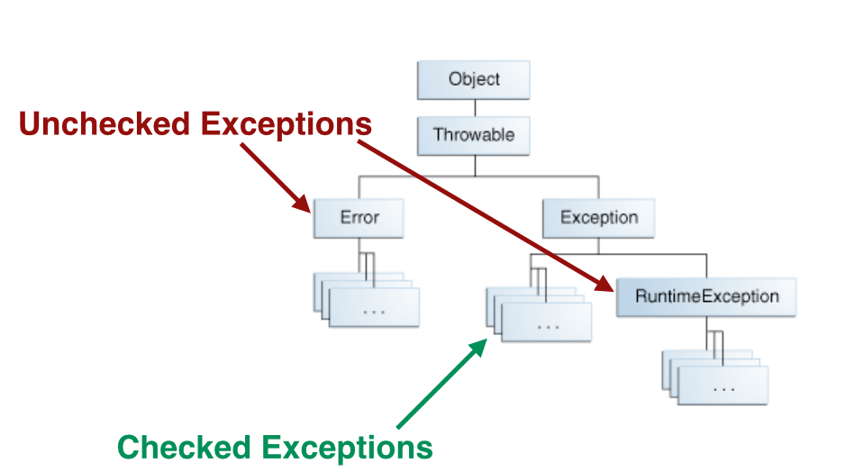

## What is an exception?

* An exception is an event that occurs when a program runs interapting its normal flow.


## The exception handler

* We can use the ```try-catch``` construct.
```java
try {
    some code here
} catch and finally blocks …
```


## Throws

* We can declare a might-thrown exception in method signatures.
```java
public void writeList() throws IOException, IndexOutOfBoundsException {...}
```


## Throw new

* We can declare a might-throw exception using the ```throw new``` keyword.
* Then, we need to also declare the exception in the method signature (using ```throws```).
```java
if (ammount < 0) {
    throw new NegativeAmmountException();
}
```


## Exception Types




## Example of Checked Exception

```java
import java.io.File;
import java.io.FileNotFoundException;
import java.io.FileReader;

public  class testClass {

	public static void main(String args[])  {		
	      File file = new File("E://file.txt");
	      try {
			FileReader fr = new FileReader(file);
		} catch (FileNotFoundException e) {
			// TODO Auto-generated catch block
			e.printStackTrace();
		} 
	   }
}
```


## Example of Unchecked Exception

```java
	import java.io.*;
	
	public calss ExcepTest {
		public static void main(String[] args) {
			try {
				int a[] = new int[2];
				System.out.println("Access elements three:" + a[3]);
			} catch(ArrayIndexOutOfBoundsException e) {
				System.out.println("Exception thrown :" +e);
			}
			System.out.println("Out of the block");
		}
	}
```


## Using finally

```java
public class ExcepTest {

   public static void main(String args[]) {
      int a[] = new int[2];
      try {
         System.out.println("Access element three :" + a[3]);
      }catch(ArrayIndexOutOfBoundsException e) {
         System.out.println("Exception thrown  :" + e);
      }finally {
         a[0] = 6;
         System.out.println("First element value: " + a[0]);
         System.out.println("The finally statement is executed");
      }
   }
}
```


## What is a stack trace?

* A stack trace is the result of a crashes application
and it can inform programs about the cause of the crash.
* Use the method ```printStackTrace()``` to get a stack trace
if a method failed.


## Stack trace example

```java
HighLevelException: MidLevelException: LowLevelException
         at Junk.a(Junk.java:13)
         at Junk.main(Junk.java:4)
 Caused by: MidLevelException: LowLevelException
         at Junk.c(Junk.java:23)
         at Junk.b(Junk.java:17)
         at Junk.a(Junk.java:11)
         ... 1 more
 Caused by: LowLevelException
         at Junk.e(Junk.java:30)
         at Junk.d(Junk.java:27)
         at Junk.c(Junk.java:21)
         ... 3 more
```


## Create a new exception class

* We can create our own exception class by extending an alreading existing exception class e.g. ```Exception```, ```RuntimeException```.


# Best practices

* Do not use generic or to specialized exceptions.
* Give meaningful names to the new exception class you create.
* Alway document your exceptions and explain when the might be thrown.
* You should always catch checked exceptions, but also pay attention to unchecked exceptions, too.
* Read carefully the documentation of the methods you call from an API and check if they throw exceptions.


# Excercise 1a

* Create a public class called Bootcamp that has a public static method with the name welcome,
which doesn't return any result. Method welcome has one (double) argument.
If method argument's value is greater than 25, the method produces an exception called DigitException.
Otherwise, the method produces an exception called AnotherDigitException.


# Excercise 1b

* Class Bootcamp has also a public static method called bye
that has no arguments and its type is int. Method bye calls method welcome
with argument 299.7 and returns 605 when method welcome produces the exception DigitException
and 230 when method welcome produces the exception AnotherDigitException.
