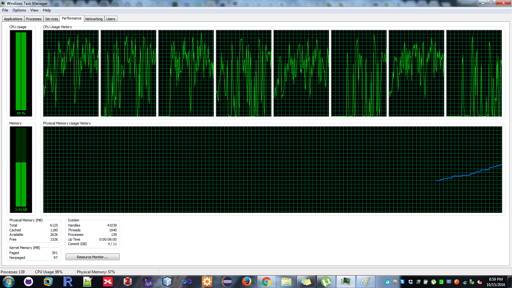
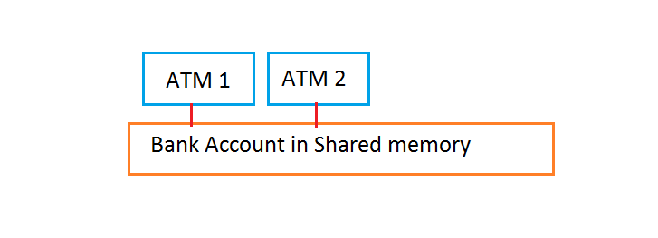

## Aim of the course
* Provide general knowledge and understanding for generics
* Explain how processes and threads work


## What are the generics
* Approach that provides stability in code by identifing bugs on compiler-time
* Compiler-time and run-time bugs
* Run-time bugs are much more hard to identify and may not crush at a specific part of code


## Why to use Generics
* Generics allow classes, interfaces, and methods type parameterization
* Type parameterization allows code re-usability with different inputs, i.e.,objects
* Strong type checking on compile-time
* Nullifying type casting
* Allow programmers to create generic algorithms


## Generics example
* Non-generic parameter
```java
	List list = new ArrayList();
	list.add("BootCampers are the best");
	String str = (String) list.get(0);
```

* Generic parameter
```java
	List<String> list = new ArrayList<String>();
	list.add("BootCampers are the best");
	String str = list.get(0); // No casting requires
```


## Generic Types (1)
Allows user to define type for a Class or an Interface
```java
	public class Box {
		private Object object;
    		public void set(Object object) { this.object = object; }
    		public Object get() { return object; }
}
```
class name`<T1, T2, ..., Tn>` { /* ... */ }
```java
	public class Box<T> {
    	// T stands for "Type"
    	private T t;

    	public void set(T t) { this.t = t; }
    	public T get() { return t; }
}
```


## Generic Types (2)
* Any object in the aforementioned exmaple can be replaced by T
* Type variable, parameters can be any non-primitive type, e.g., class, interface, array, or even another type variable

```java 
	public class BoxInTheBox<T,Box<String>> {
	/* Some code */
}
```


## Diamond Generics
* Available after SE 7 and later.
* Allows programmer to add an empty type arguments (<>) while calling the constructor
* Statement of the object although always require the type arguments 

```java
	Box<Object> objBoxer = new Box<>();
```


## Multiple parameters in generics
```java
	class Pairing <O1, O2> {
		private O1 obj1;
		private O2 obj2;
		public Pairing(O2 o2, O1 o1) {
			this.obj1 = o1;
			this.obj2 = o2;			
		}	

		public O1 getFirstO1() {
			return this.obj1;		
		}

		public O2 getFirstO2() {
			return this.obj2;		
		}

		public String toString() {
			return "(" + obj1.toString() + ", "+obj2.toString() + ")";		
		}
	}

	class Male {}
	class Female {}
	
	class Test {
		public static void main(String[] args) {
			Male newMale = new Male();
			Female newFemale = new Female();
			Pairing<Male, Female> marryThem = new Pairing<>(newFemale, newMale);
			System.out.println(marryThem.toString());	
		}		
	}
```


## Introducation to Threads
* Thread is a piece of code that lives inside a process
* Process is a program under execution running in a sequential manner
* Each process in the Operating System represents a unit of work or task
* When creating a process we allocate space were the threads are created
* A process can have from 1-to-Many threads


## Process real-world example


## Threads real-world example



## Concurrency and Parallelism
* Concurrency means that an application is making progress on more than one task at the same time 
* May not finish one task before starting another
* Parallelism can split a single task in many subtasks
* Using multiple CPUs can execute tasks on the same time


## Problems with Concurrency (1)
* Consider the following example where a married couple decide to depose money in their common bank account
* Initially the bank account has $50
* Both are deposing money from two different ATMs



## Problem with Concurrency (2)
Scenario when everything is normal
```java
	get balance (balance = $50)
	add $100
	write back result (balance = $150)
					get balance (balance = $150)
					add $50
					write back result (balance = $200)
```
Scenario with concurrency
```java
	get balance (balance = $50)
					get balance (balance = $50)
	add $100
						add $50
	write back result (balance = $150)
					write back result (balance = $100)
```


## Problem with Concurrency (3)
Scenario with parallelism
```java
	get balance (balance = $50) 	   get balance (balance = $50)				
	add $100			   add $50
	write back result (balance = $150) write back result (balance = $100)
```


## Ways for executing threads (1)
* Java supports two different ways of executing threads
* Declare a class to extend from Thread class
* Override the run method of the Thread class
```java
	class FindCountOfEvenNumbers extneds Thread {
		private int maxNumber;
		private int count;
		FindCountOfEvenNumbers(int maxNumber) {
			this.maxNumber = maxNumber;
			this.count = 0;		
		}
	
		public void run() {
			for (int i=0; i<this.maxNumber; ++i)
			{
				if (i % 2 == 0)
					++count;		
			}	
		}
	}
```


## Executing our thread
```java
	FindCountOfEvenNumbers newThread = new FindCountOfEvenNumbers(1200);
	new Thread(findNumber).start();
```

```java
        FindCountOfEvenNumbers findNumber = new FindCountOfEvenNumbers(1200);
        Thread t = new Thread(findNumber);
	t.start();
```


## Ways for executing threads (2)
* Declare class that implements the Runnable interface
* That class impements the run methods too
```java
	class FindCountOfEvenNumbers implements Runnable {
		private int maxNumber;
		private int count;
		FindCountOfEvenNumbers(int maxNumber) {
			this.maxNumber = maxNumber;
			this.count = 0;		
		}
	
		public void run() {
			for (int i=0; i<this.maxNumber; ++i)
			{
				if (i % 2 == 0)
					++count;		
			}	
		}
	}
```


## Differences from using Thread and Runnable
* After extending Thread class you can't extend any other that you may require in the future
* After implementing Runnable you may extend from other class on the spot or in the future
* Extending creates different objects of the Tread class, on the other hand, in Runnable many threads can share the instance of the same object


## Example of ThreadVsRunnable (1)
```java
	//Implementing Runnable Interface
	class ImplementsRunnable implements Runnable {
		private int counter = 0;
		public void run() {
			counter++;
			System.out.println("ImplementsRunnable : Counter : "+ counter);
		}
	}

	//Extending Thread class
	class ExtendsThread extends Thread {
		private int counter = 0;
		public void run () {
			counter++;
			System.out.println("ExtendsThread : Counter : "+ counter);
		}
	}
```


## Example of ThreadVsRunnable (2)
```java
	public class ThreadVsRunnable {
		public static void main(String args[]) throws Exception {
    			// Multiple threads share the same object.
    			ImplementsRunnable rc = new ImplementsRunnable();
    			Thread t1 = new Thread(rc);
    			t1.start();
    			Thread.sleep(1000); // Waiting for 1 second before starting next thread
  			Thread t2 = new Thread(rc);
    			t2.start();
    			Thread.sleep(1000); // Waiting for 1 second before starting next thread
    			Thread t3 = new Thread(rc);
    			t3.start();

    			// Creating new instance for every thread access.
    			ExtendsThread tc1 = new ExtendsThread();
    			tc1.start();
    			Thread.sleep(1000); // Waiting for 1 second before starting next thread
    			ExtendsThread tc2 = new ExtendsThread();
    			tc2.start();
    			Thread.sleep(1000); // Waiting for 1 second before starting next thread
    			ExtendsThread tc3 = new ExtendsThread();
    			tc3.start();
 		}
	}
```


## Results of ThreadVsRunnable
```java
	ImplementsRunnable : Counter : 1
	ImplementsRunnable : Counter : 2
	ImplementsRunnable : Counter : 3

	ExtendsThread : Counter : 1
	ExtendsThread : Counter : 1
	ExtendsThread : Counter : 1
```


## Pausing and Stopping a threads execution (1)
* Thread.sleep sunspends thread execution for a specified amount of time

```java
	Thread pThread = new Thread();
	pthread.start();
	//Make thread sleep for 5 seconds
	pthread.sleep(5000);
	//Interrupts thread's execution
	pthread.stop();
```


## Stopping a threads exexution (2)
* Sleep period of a thread can be termindated by interrupts
* Programmer has to decide the threads behavior on interrupts, usually termination

```java
	class TestInterruptingThread1 extends Thread{  
	public void run(){  
		try {  
			Thread.sleep(10000);  
			System.out.println("task");  
		} catch(InterruptedException e) {  
			throw new RuntimeException("Thread interrupted..." + e);  
	}  
}  
  
	public static void main(String args[]){  
		TestInterruptingThread1 t1 = new TestInterruptingThread1();  
		t1.start();  
		try {  
			t1.interrupt();  
		} catch(Exception e) {
			System.out.println("Exception handled " + e);
}   
	}  
}  	
```


## Output of interrupt thread
```java
	Exception in thread "Thread-0" java.lang.RuntimeException: Thread interrupted...java.lang.InterruptedException: sleep interrupted
	at TestInterruptingThread1.run(TestInterruptingThread1.java:7)

```


## Thread Join(1)
* Method that allows a thread to wait for the completion of another thread.
```java
	t.join();
```
Consider a thread P running and find t.join() in its execution code, P thread must wait from t thread to finish in order o continue its execution.
```java 
	FindCountOfEvenNumbers findNumber = new FindCountOfEvenNumber(1200);
	Thread t = new Thread(findNumber);
	t.start();
	System.out.println("Now thread " + t.getName() + " is running");
	t.join();
```


## Thread Join(2)
* Method that allows a thread to wait for the completion of another thread.
```java
        t.join();
```
Consider a thread P running and find t.join() in its execution code, P thread must wait from t thread to finish in order o continue its execution.
```java 
        FindCountOfEvenNumbers findNumber = new FindCountOfEvenNumber(1200);
        Thread t = new Thread(findNumber);
        t.start();
        System.out.println("Now thread " + t.getName() + " is running");
        t.join(1000);
```


## SimpleThread Example (1)
```java	
	public class SimpleThreads {
    		static void threadMessage(String message) {
        		String threadName = Thread.currentThread().getName();
        		System.out.format("%s: %s%n",threadName, message);
    	}

    		private static class MessageLoop implements Runnable {
        	public void run() {
            	String importantInfo[] = {"Mares eat oats","Does eat oats","Little lambs eat ivy","A kid will eat ivy too"};
            	try {
                for (int i = 0; i < importantInfo.length; i++) {
                    Thread.sleep(4000);
                    threadMessage(importantInfo[i]);
                }
            	} catch (InterruptedException e) {threadMessage("I wasn't done!");
            	}
        	}
    	}

    public static void main(String args[])throws InterruptedException {
```


## SimpleThread Example (1)
```java
	public static void main(String args[])throws InterruptedException {
        long patience = 1000 * 60 * 60;
        // If command line argument
        // present, gives patience
        // in seconds.
        if (args.length > 0) {
            try {
                patience = Long.parseLong(args[0]) * 1000;
            } catch (NumberFormatException e) {
                System.err.println("Argument must be an integer.");
                System.exit(1);
            }
        }

        threadMessage("Starting MessageLoop thread");
        long startTime = System.currentTimeMillis();
        Thread t = new Thread(new MessageLoop());
        t.start();

        threadMessage("Waiting for MessageLoop thread to finish");
        while (t.isAlive()) {
            threadMessage("Still waiting...");
            t.join(1000);
            if (((System.currentTimeMillis() - startTime) > patience)&& t.isAlive()) {
                threadMessage("Tired of waiting!");
                t.interrupt();
                t.join();
            }
        }
        threadMessage("Finally!");
    }
}
```


## Synchronized Methods
* Help to keep data consistency in a shared variable.
* When a single thread is executing a synchronized method all the other threads that invoke synchronized method are block until the first thread is finished

```java
	public synchronized dataype method() {}
```


## Examples with Synchronization (1)
```java	
public class Counter implements Runnable {
    private int c = 0;

    public synchronized void increment() { c++; }
    public synchronized void decrement() { c--; }
    public synchronized int value() { return c; }
    public synchronized void run() {
        increment();      
        System.out.println("I am thread" + Thread.currentThread().getName() + "and the c value is " + value());
        decrement();
    }
}
```


## Examples with Synchronization (2)
```java
public class SimpleThreadWithMain {

	public static void main(String[] args) {
		// TODO Auto-generated method stub
		Counter variableA;
		variableA = new Counter();
		new Thread(variableA).start();
		new Thread(variableA).start();
		new Thread(variableA).start();
		new Thread(variableA).start();
		new Thread(variableA).start();
		new Thread(variableA).start();
	}

}
```


## Exercises


## Exercise 1
It's give to you a class name Hedonism that receives five parametric types and also class Granch. 
Also create four classes with the following names: Cellulase, Semiserf, Mina, and Contrite 
with nothing inside the classes.
Now, create a class named Trikeria with public visibility and main class that has a public static 
method named stenchful. 
This method does not have any arguments. This method also creates objects from classes Cellulase, Semiserf, 
Mina, Contrite, and Granch. Furthermore, it creates an object from class Hedonism with the parameter types 
of Cellulase, Semiserf, Mina, Contrite, and Granch (with this exact sequense). In the end, method stenchful 
calls method myoglibin from class Hedonism with the "correct created object" and returns the result of the 
method....


## Exercise 1 (Cont.)
The return data type of myoglobin defines the return time of stenchful too.
At the end call method print from Granch class.
Source code can be found at https://drive.google.com/open?id=0B4OihM0nDwEJNERadzZKSGhHYkE


## Exercise 2 
Write a generics method that can swap the first element of an array with the last, the 
second with the semilas and keep going.
The first array has int as data type with numbers from 1 to 10.
The second array has double as data type with numbers from 1 to 10.


## Exercise 3
Does the following code compiles without any error?
```java
	public final class Algorithm {
    		public static <T> T max(T x, T y) {
        		return x > y ? x : y;
    		}
	}
```
Take your time to think about it, the answer is on the next page


## Exercise 3 (Answer)
No! The ">" symbols applies only on primitive numeric types


## Exercise 4
Remove the synchronized parameter from all the methods of the Counter and run the program and observe its behavior.


## Exercise 5
Consider having an array with elements starting from 1,2,3,....,998,999,1000.
Create a thread pool with any data structure you like (array, linklist, arraylist, etc.) that has 10 threads.
Balance your work-load among threads and find out the sum of all elements from the array.
This problem can be solved easily with many others ways, although, you are summoned to solve it 
using threads.


## Exercise 6
For this exercise you are called to create Fibonacci program and find the end results of number 50. 
Create a thread that will execute the Fibonacci code and when the thread is done print the end result.
Use the existing class from here https://drive.google.com/open?id=0B4OihM0nDwEJRGtnaHhTaUhqV1U 
As an advanced part of this exercise try to reduce the programs execution time with multiple 
threads
Results = 12586269025


## Link to enchance your programming skills
* https://www.hackerrank.com/
* https://projecteuler.net/ s


## References
* http://stackoverflow.com/questions/541487/implements-runnable-vs-extends-thread
* https://docs.oracle.com/javase/7/docs/api/
