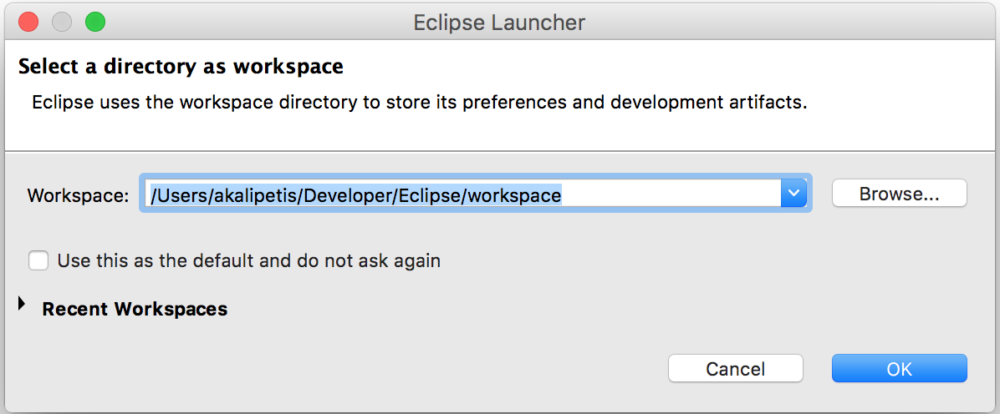
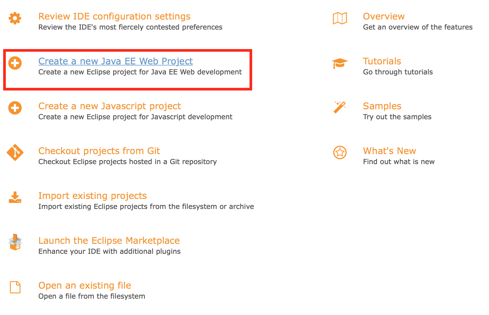
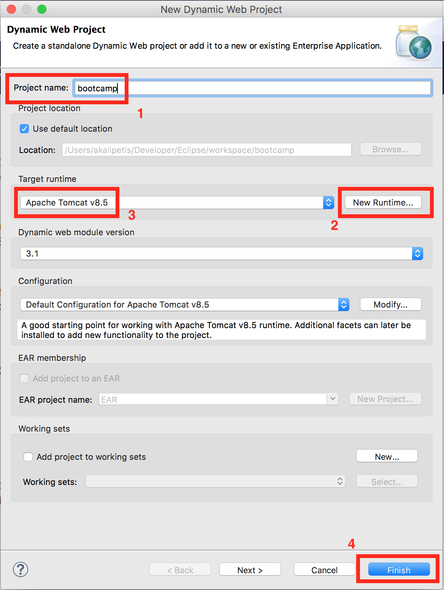
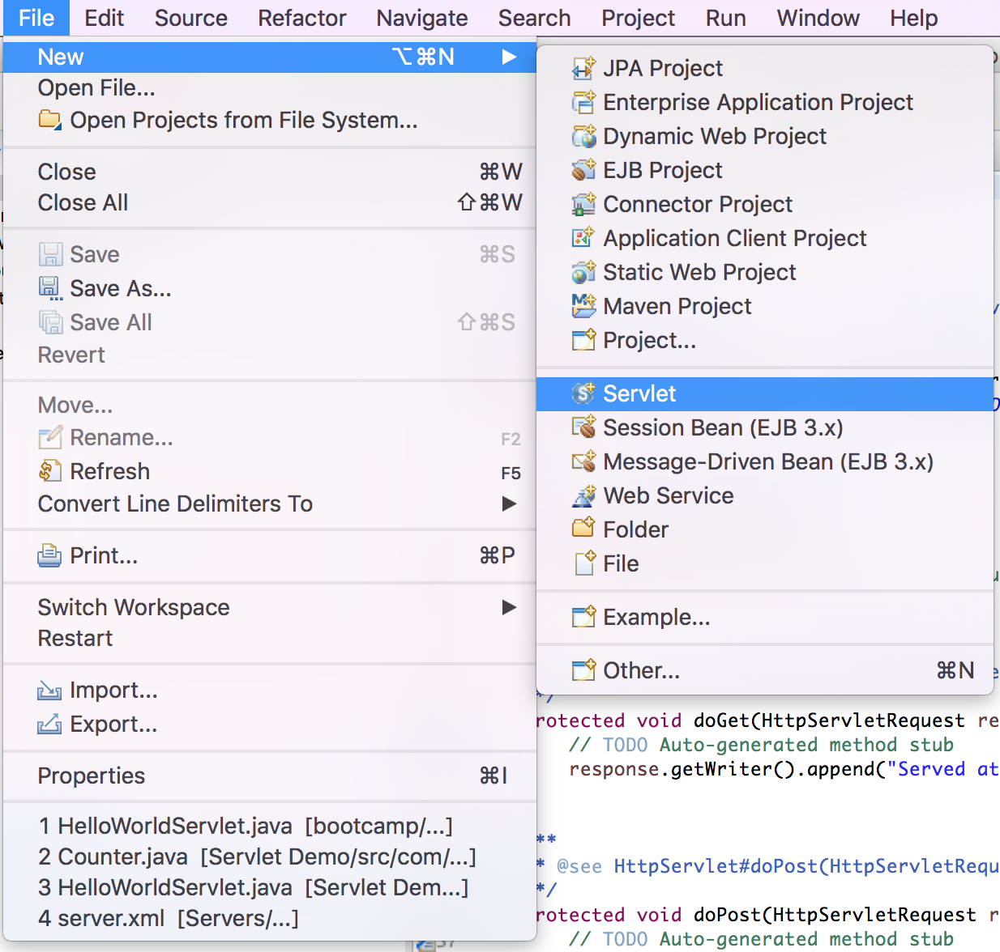
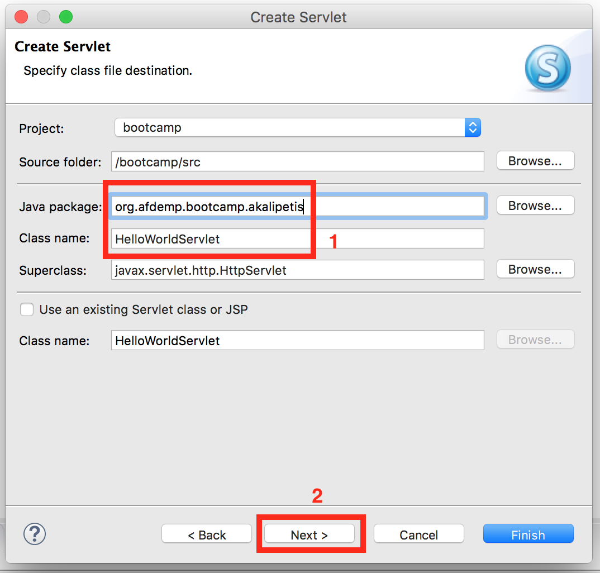
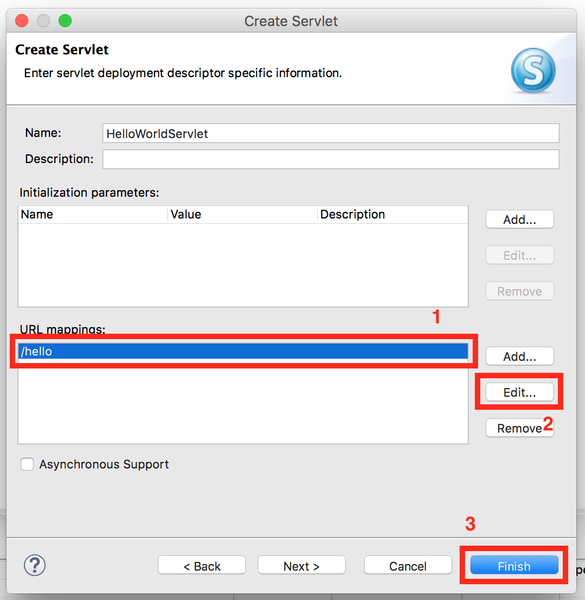
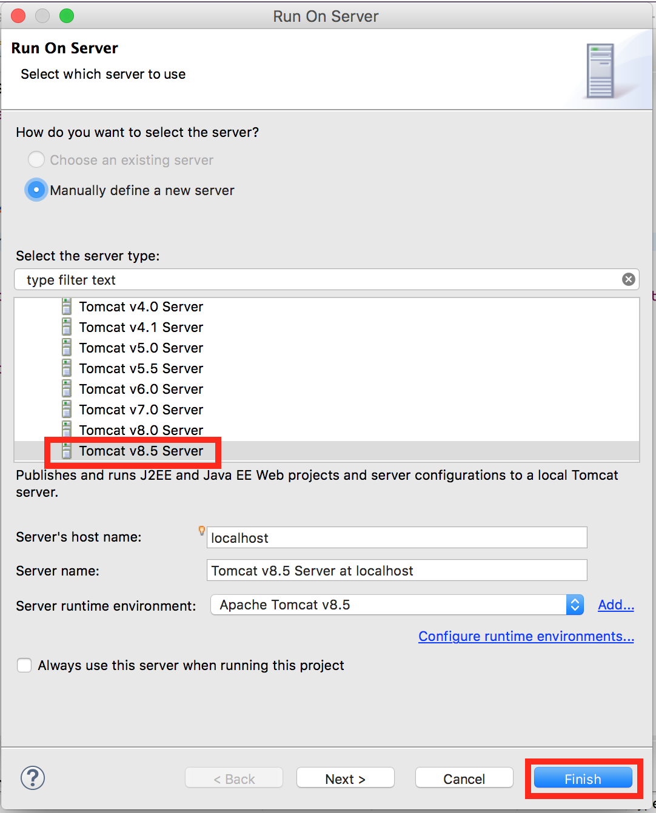
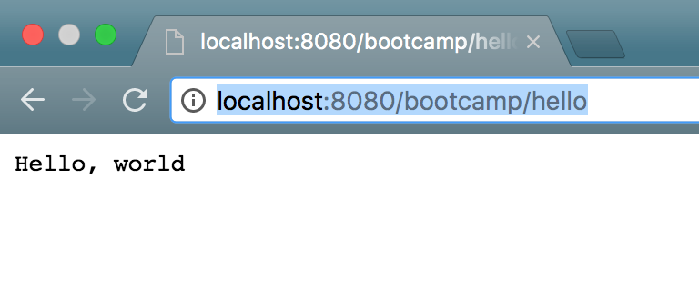
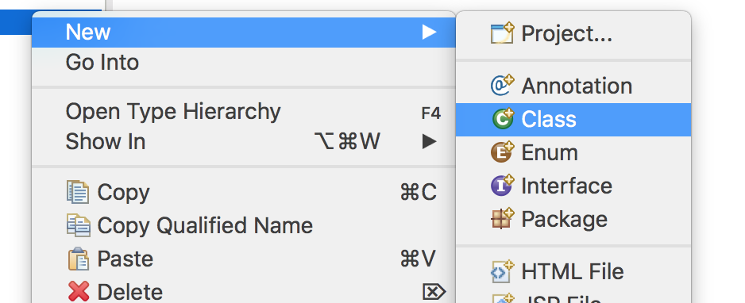

## Hello Servlet

Antonis Kalipetis

[@akalipetis](https://twitter.com/akalipetis) - [https://www.akalipetis.com](https://www.akalipetis.com)


## Agenda

* What is a Servlet?
* Responding to HTTP requests
* The Servlet API
* Servlet examples


## Servlets

A Java servlet is a Java program that **extends the capabilities of a server**.

Servlets respond to **HTTP requests** and reply with **HTTP responses**.

Notes:

* Servlets are the simplest way to implement a web server in Java
* They implement all common HTTP verbs, except `PATCH`


## Defining a Servlet

* Which URI will it respond to
* What HTTP verbs will it implement
* The actual implementation, doing the needed Java calls when a request is sent over


## Let's setup Eclipse!


Notes:

* [Download Eclipse for JavaEE](http://www.eclipse.org/downloads/)
* [Download Tomcat](http://tomcat.apache.org/download-80.cgi)
* Install Eclipse
* Unzip Tomcat in a known location


## Create a new workspace




## Create a new project




## Select project runtime




## Create a new Servlet




## Select package and classname

_In Java, we use usually reverse domains for package names_




## Set the Servlet URI to `/hello`




## A simple servlet

```java
@WebServlet("/hello")
public class HelloWorldServlet extends HttpServlet {

	protected void doGet(HttpServletRequest request, HttpServletResponse response) throws ServletException, IOException {
		response.getWriter().append("Hello, world");
	}

	protected void doPost(HttpServletRequest request, HttpServletResponse response) throws ServletException, IOException {
		doGet(request, response);
	}
}
```


## Let's run our servlet


## Create a new server configuration




## Visit http://localhost:8080




## Let's create a counting page

First, we'll create a `Counter` `class`




## The `Counter` class

```java
public class Counter {
    private int mCnt = 0;

    public int increment() {
        return ++mCnt;
    }

    public int getCounter() {
        return mCnt;
    }
}
```


## A count servlet

```java
@WebServlet("/count")
public class CountServlet extends HttpServlet {
    private Counter mCnt = new Counter();

	protected void doGet(HttpServletRequest request, HttpServletResponse response) throws ServletException, IOException {
		response.getWriter().append(String.valueOf(mCnt.increment()));
	}

	protected void doPost(HttpServletRequest request, HttpServletResponse response) throws ServletException, IOException {
		doGet(request, response);
	}
}
```


## Getting input from the user

Input from the user can be supplied in two different ways, depending on the HTTP method used.

* `GET` requests contain URL arguments
  * `/page?param1=one&param2=two`
* `POST` requests container a body with form data


## Getting input

You can get a query parameters for `GET` requests or form data for `POST` requests with `request.getParameter("param_name")`


## Extending the hello servlet

```java
@WebServlet("/hello")
public class HelloWorldServlet extends HttpServlet {

	protected void doGet(HttpServletRequest request, HttpServletResponse response) throws ServletException, IOException {
		response.getWriter().append("Hello, ").append(request.getParameter("name"));
	}

	protected void doPost(HttpServletRequest request, HttpServletResponse response) throws ServletException, IOException {
		doGet(request, response);
	}
}
```


## Redirecting users

Redirecting users to another page is simply done using the `response.sendRedirect`. This will respond with a `302 FOUND` status code and direct the user to the new page.


## A redirect example

Simply hit `http://localhost:8080/bootcamp/redirect?next=new_url`

```java
@WebServlet("/redirect")
public class RedirectServlet extends HttpServlet {

	protected void doGet(HttpServletRequest request, HttpServletResponse response) throws ServletException, IOException {
        response.sendRedirect(request.getParameter("next"));
	}

	protected void doPost(HttpServletRequest request, HttpServletResponse response) throws ServletException, IOException {
		doGet(request, response);
	}
}
```

Notes:

* The user will be redirected to the URL defined inside the `next` parameter
* The Browser will get a `302 FOUND` response and will then load the next page
* Also ideal for redirecting to pages outside of the server


## "Internally" redirecting users

There are times when a request needs to be served by another Servlet, but we don't want to send a `302 FOUND` response to the user.

In such cases, use the `RequestDispatcher`.

Defines an object that receives requests from the client and sends them to any resource (such as a servlet, HTML file, or JSP file) on the server.


## Dispatcher example

```java
@WebServlet("/dispatch")
public class DispatchServlet extends HttpServlet {
	
    protected void doGet(HttpServletRequest request, HttpServletResponse response) throws ServletException, IOException {
		request.getRequestDispatcher("/hello").forward(request, response);
	}

	protected void doPost(HttpServletRequest request, HttpServletResponse response) throws ServletException, IOException {
		doGet(request, response);
	}

}
```

Notes:

* The browser will never know about this redirect
* These redirects can only be internal, can't redirect to an external URL
* That's like internally calling the other Servlet


## Time to train


## Exercise 1

Create a servlet that returns the current date and time

_Hint: the `Date` class gives the current date_


## Exercise 2

Create a servlet that returns the IP of the visitor

_Hint: the IP should be somewhere in the request..._


## Exercise 3

Create a servlet that returns `Success!` if the `entry` query parameter is a prime number, otherwise redirects to `/bootcamp/hello`


## Exercise 4

Create servlet that accepts a `POST` request and returns the keys submited in the following form:

```
key1: value1
key2: value2
...
```


## Exercise 5

* Create a `Game` class that:
  * Has a `play` public method which, when called:
    * Rolls the dice
    * If a game is running, returns "Won" or "Lost"
    * If a game is not running, returns the result
* Create a `GameServlet` that:
  * Has an instance of a `Game`, `mGame`
  * When a request hits `/play`, calls `mGame.play`
  * Returns the result to the user


## Exercise 6

Extend the `CountServlet` that when a request hits `/count`, it's internally dispatching the request to:

* `/hello` - if the count is even
* `/play` - if the request is odd


## Exercise 7

Create the servlets needed for the forms of your application


## Bonus exercise

Connect your servlet to a database and return the results of a query


## Thanks!

[@akalipetis](https://twitter.com/akalipetis) - [https://www.akalipetis.com](https://www.akalipetis.com)
