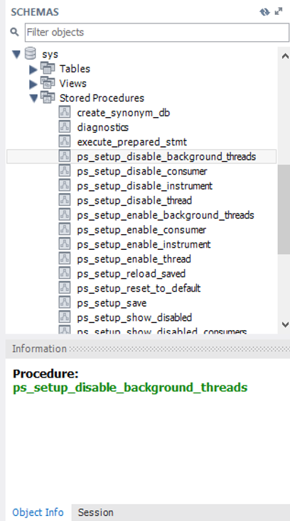
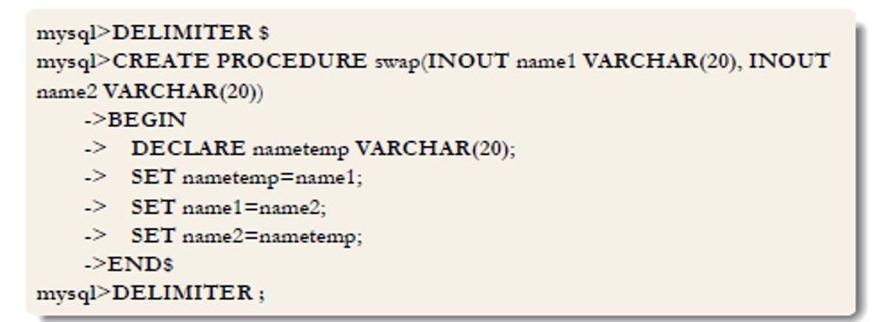
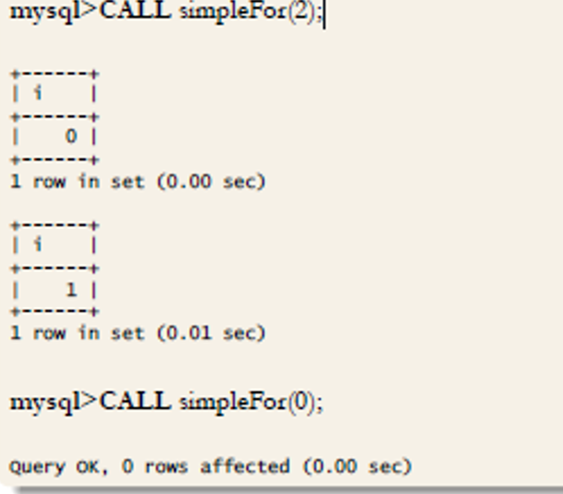
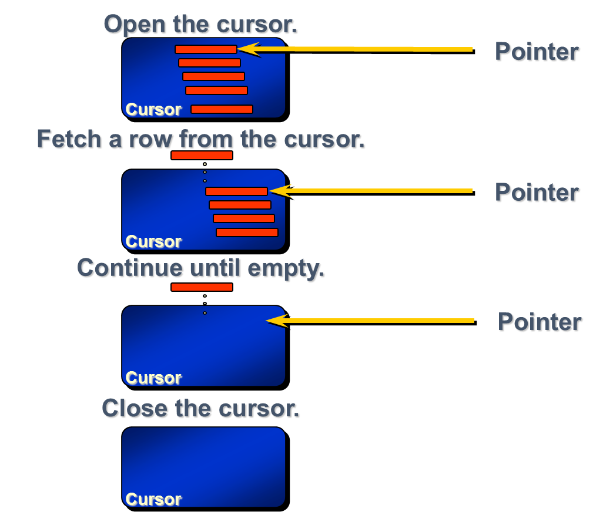
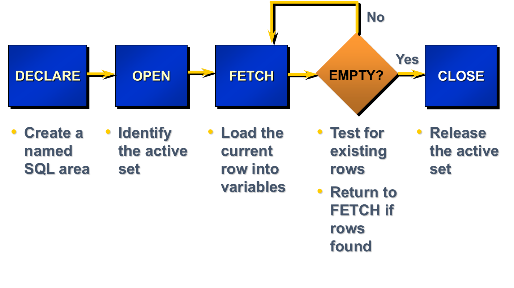

## Stored Procedures, Cursors, Triggers, Indexes


## Stored Procedures


## Stored Procedures
* A stored procedure (also termed proc, storp, sproc, StoPro, StoredProc, StoreProc, sp, or SP) is a subroutine - a pre-defined batch of code-  available to applications that access a relational database management system (RDMS).
* It includes all the statements of SQL, but we can also use if, then, else blocks and while loops.


## Stored Procedures


## Stored Procedures Benefits
* Code Reusability 
  * SQL Server compiles and stores these in memory for future use
* Enhanced Security
  * Requires valid permissions to execute
  * Users can have permission to execute a stored procedure, without having permission to read from the underlying tables or views
  * You can specify the security context
  * Owner, Caller or User
* Speed / Optimization
  * Stored procedures are cached on the server


## Stored Procedures Drawbacks
* Limited Coding Functionality
  * Stored procedure code is not as robust as app code, particularly in the area of looping (not to mention that iterative constructs, like cursors, are slow and processor intensive)
* Testing
  * Any data errors in handling Stored Procedures are not generated until runtime
* Portability
  * Complex Stored Procedures that utilize complex, core functionality of the RDBMS used for their creation will not always port to upgraded versions of the same database. This is especially true if moving from one database type (Oracle) to another (MS SQL Server).


## Stored Procedures
* SQL Server, My SQL etc. have many built-in stored procedures, called System Stored Procedures
  * Used for maintenance and management activities
  * They start with the ps_ prefix i.e. ps_tables
  * Owned by the sys schema in each database


## Store Procedures



## T-SQL Store Procedures
* T-SQL: Transact-SQL is proprietary extension to the used to interact with relational databases
* SP are batches of T-SQL code stored as an object in the database
* They can accept input parameters
* They can return various output types


## T-SQL Store Procedures


## Creation, calling & deleting a SP
* Creating a procedure 
  * CREATE PROCEDURE hello_world()
* Calling a Stored Procedure
  * Exec or Call hello_world(<param list>)
* Show the script of an already created procedure
  * SHOW CREATE PROCEDURE hello_world();
* Delete a store procedure
  * DROP PROCEDURE hello_world();


## ST Creation
* CREATE PROCEDURE hello_world() SELECT * FROM student;
* CALL hello_world();
* Returns:


## SP – Structure (My SQL)
```
DELIMITER //  ##declare the character  end the procedure
CREATE PROCEDURE test()   
BEGIN  
 	SELECT *  FROM actor;   
END //
CALL test() ;
DROP PROCEDURE test;
```


## SP – Example (My SQL)
```
DELIMITER $
CREATE PROCEDURE hello_world2()
BEGIN
 SELECT * FROM student ORDER BY am;
 SELECT * FROM course ORDER BY course_id;
 SELECT * FROM registration;
END$

CALL hello_world2();
```


## SP – Example (My SQL)


## Value Assignments
* We can set a value into a variable
* Its value last for a specific session 
* The name should start with a “@”
* The value assignment is done using the SET command
  * SET @x=4;
  * SET @y=7;
  * SET @z=@x-@y;
* We can print the value of a variable using the select command, e.g: 
  * Select @x;


## Declarations in a SP
* We can create a variable in a procedure.
* Each variable lasts for the specific session
* We can use “DECLARE” command to declare a variable
* We have to declare its data type e.g:
  * DECLARE id INT;
  * DECLARE name VARCHAR(20);
  * DECLARE birthday DATETIME;
* The declarations should be made at the beginning of the store procedure


## Declarations & value assignments in SP



## Input & Output of a SP
* SP could receive an input and return an output when we call then using parameters
* Parameters are declared as arguments in a SP
* We have 3 different types of arguments:
* IN arguments
  * Its value is used as an input in the procedure.
  * When their value is changed in the SP environment  it is not transferred to the rest environment
  * Default type of arguments
* OUT arguments 
  * Its value is not used as an input in the procedure (NULL).
  * When their value is changed in the SP environment  it is transferred to the rest environment
* INOUT arguments
  * Combines both IN & OUT arguments


## Input & Output of a SP – Example (1/2)
```
DELIMITER $
CREATE PROCEDURE afairesi(IN a INT, IN b INT, OUT result INT)
BEGIN
SET result=a-b;
END$
DELIMITER ;

CALL afairesi(5,4,@res);

SELECT @res; (result=1)
```


## Input & Output of a SP – Example (2/2)
```
DELIMITER $
CREATE PROCEDURE arnitiko(INOUT num INT)
BEGIN
 SET num=-num;
END$
mysql>DELIMITER ;

mysql>SET @y=17;
mysql>CALL arnitiko(@y);
mysql>SELECT @y;
```


## SP – Example, MSSQL


## Flow control structures
* MySQL supports flow control structures
* The basic are:
  * If-then-else
  * While loops
  * Repeat loops
  * Case


## SP – If, Then, else Example
```
IF condition
	THEN statement/s
ELSEIF condition
	THEN statement/s
ELSE
```
```
DELIMITER $
CREATE PROCEDURE absolute(IN num INT, OUT abs_num INT)
BEGIN
IF(num<0) THEN
	SET abs_num=-num;
ELSE
	SET abs_num=num;
END IF;
END$
mysql>DELIMITER ;
```


## SP – If, Then, else Example
```
DELIMITER $
CREATE PROCEDURE pointOfTime(IN inputDay DATE)
BEGIN
 DECLARE currentDay DATE;
 SET currentDay=CURDATE();
 IF(inputDay>currentDay) THEN
 	SELECT 'Future';
 ELSEIF(inputDay=currentDay) THEN
 	SELECT 'Present';
 ELSE
 	SELECT 'Past';
 END IF;
END$
DELIMITER ;
CALL pointOfTime('2011-12-31');
```
What else we could do?


## Store Procedure Example - MSSQL
```
CREATE PROCEDURE SP_ChangeSupplier @FromSID INT,@ToSID INT,  @Result INT OUTPUT AS
DECLARE @Error INT
set @Error = 0
Begin
IF @ToSID>0
Begin
Update Products
Set SupplierID = @ToSID
WHERE SupplierID =@FromSID
End
Else 
	@Error = 1
End
Set @Result =@Error
GO
```
Calling the SP
EXEC SP_ChangeSupplier (30, 37, @r output)

Dropping the SP
DROP PROCEDURE SP_ChangeSupplier 


## WHILE
```
WHILE condition
	DO statement/s
END WHILE;
```
```
DELIMITER $
CREATE PROCEDURE simpleFor(IN maxNum INT)
BEGIN
 	DECLARE i INT;
 	SET i=0;
 	WHILE(i<maxNum AND maxNum>=0) DO
 		SELECT i;
		 SET i=i+1;
 	END WHILE;
END$
DELIMITER ;
```


## WHILE



## If –then-else & While / MS SQL


## REPEAT
```
REPEAT statement/s
	UNTIL condition
END REPEAT;
```
```
DELIMITER $
CREATE PROCEDURE simpleForAlt(IN maxNum INT)
BEGIN
 DECLARE i INT;
 SET i=0;
 REPEAT
 SELECT i;
 SET i=i+1;
 UNTIL(i>=maxNum OR maxNum<0)
 END REPEAT;
END$
```
CALL simpleForAlt(2);


## REPEAT


## CASE
```
CASE
WHEN condition1 THEN statement/s
WHEN condition2 THEN statement/s
...
ELSE statement/s
END CASE;
```


## CASE


## SP: in Class Exercises (1/3)
Write a stored procedure that receives as as input the id of an employee and displays his name and his salary. Then call this procedure for the employee id=2
Employee (id, FNAME, LNAME ,SALARY)
```
CREATE PROCEDURE find_emp_salary  @ide int
AS
BEGIN
    SELECT FNAME
      ,LNAME
      ,SALARY
FROM EMPLOYEE
WHERE ID = @ide
END
CALL find_emp_salary (2);
```


## SP: in Class Exercises (2/3)
Write a stored procedure that receives as input the id of an employee and returns his id and the number of projects he participates in 
Employee (id, NAME)
Works_On (idEmpl, project)
```
CREATE PROCEDURE find_emp_projects @ide int
AS
BEGIN
	SELECT a.Name, COUNT(b.project) AS NUM_OF_PROJECT
	FROM EMPLOYEE a
	INNER JOIN WORKS_ON b
	ON a.id=b. idEmpl
	WHERE a.ID = @ide
	GROUP BY a.Name
END
--------
exec find_emp_projects (@ide)
```


## SP: in Class Exercises (2/3)
-OR-
```
CREATE PROCEDURE find_emp_projects @ide int, @numb int out
AS 
BEGIN
	 SET @numb =(
	SELECT COUNT(b.project)
	FROM EMPLOYEE a
	INNER JOIN WORKS_ON b
	ON a.id=b. idEmpl
	WHERE a.ID = @ide
	GROUP BY a.Name)
	END
------
exec find_emp_projects (@ide, @numb)
Select @ide, @numb
```


## SP: in Class Exercises (3/3)- Solution MS SQL
Write a stored procedure that receives as input the sex and the department and displays the average salary of the employees
Employees (id, name, salary, sex, Did)
Department(Did, Dname)
```
CREATE PROCEDURE find_avg_salaries @sex nvarchar(20), @department nvarchar(50)
AS
BEGIN
SELECT	d. DNAME,
		e.SEX,
       	avg(e.SALARY) AS AVG_SALARY
 	FROM EMPLOYEE e
	INNER JOIN DEPARTMENT d
   	ON e.DID = d.DID
  	WHERE d.DNAME = @department AND e.SEX = @sex
	GROUP BY d. DNAME
END
```


## Cursors 


## Cursors in SQL
* A mechanism to navigate tuple-by-tuple over a relation 
* Typically used inside triggers, stored procedures
* When we execute a query, a relation is returned 
* It is stored in private work area for the query 
* Cursor is a pointer to this area 
* Move the cursor to navigate over the tuples 
* Enables users to loop around a selection of data
* Use complex actions which would not be feasible in standard SQL selection queries


## Syntax for Cursors
* Declared as a variable in the same way as standard variables
* Identified as cursor type
SQL included
e.g.


## Controlling Cursor…



## Controlling Cursor



## Cursors example – MS SQL


## Advantages & Disadvantages
* Advantages:
  * Cursors are best used when performing row-by-row operations that can't be accomplished with set-based operations (i.e., when you need to fire a stored procedure once per row in a table).
  * Quick and dirty

* Disadvantage:
  * Speed and performance issues
  * A factor affecting cursor speed is the number of rows and columns brought into the cursor. Time how long it takes to open your cursor and fetch statements.


## Cursor & Procedure example - MySQL
```
DELIMITER $
DROP PROCEDURE IF EXISTS showCourseLectures$
CREATE PROCEDURE showCourseLectures(IN courseId INT)
BEGIN
 DECLARE lectSubject VARCHAR(128);
 DECLARE lectNum INT(2);
 DECLARE finishedFlag INT;
 DECLARE lectCursor CURSOR FOR
 SELECT subject, num_lecture FROM lecture WHERE course_lecture=courseId;
 DECLARE CONTINUE HANDLER FOR NOT FOUND SET finishedFlag=1;
 OPEN lectCursor;
	SET finishedFlag=0;
 	FETCH lectCursor INTO lectSubject, lectNum;
	 	WHILE(finishedFlag=0) DO
 			SELECT lectNum AS 'Αριθμός Διάλεξης', lectSubject AS 'Θέμα';
	 		FETCH lectCursor INTO lectSubject, lectNum;
	 	END WHILE;
 CLOSE lectCursor;
END$
DELIMITER ;
```


## Cursors example - MySQL
```
DELIMITER $
DROP PROCEDURE IF EXISTS showCourseLecturesAlt$
CREATE PROCEDURE showCourseLecturesAlt(IN courseId INT)
BEGIN
 DECLARE lectSubject VARCHAR(128);
 DECLARE lectNum INT(2);
 DECLARE finishedFlag INT;
 DECLARE lectCursor CURSOR FOR
 SELECT subject,num_lecture FROM lecture WHERE course_lecture=courseId;
 DECLARE CONTINUE HANDLER FOR NOT FOUND SET finishedFlag=1;
 OPEN lectCursor;
 SET finishedFlag=0;
 REPEAT
 FETCH lectCursor INTO lectSubject, lectNum;
 IF(finishedFlag=0) THEN
	 SELECT lectNum AS 'Αριθμός Διάλεξης', lectSubject AS 'Θέμα';
 END IF;
 UNTIL(finishedFlag=1)
 END REPEAT;
 CLOSE lectCursor;
END$
DELIMITER ;
```


## Triggers


## Triggers
* Triggers are very similar to stored procedures
* One big difference is: triggers cannot be manually executed
  * They only execute in response to a user action, like an INSERT
* Is called when an event occurs in the table
* Are used to:
  * Check the validity of the data that are inserted into a table 
  * To calculate derived values
  * To maintain the sign in logs and the insertions in a table
* Implementation Cost -> time consuming 


## Basic Commands
* Creation 
  * CREATE TRIGGER <trigger name>
* Delete
  * DROP TRIGGER < trigger name >
* Show Trigger Code
  * SHOW CREATE TRIGGER < trigger name >
* Show list of created Triggers
  * SHOW TRIGGERS

* Call/execute a trigger
  * We cannot call a trigger, like a procedure
  * It is executed when an event happens call it 


## Designing a Trigger
* To design a trigger we have to determine:
* In which table it would be applied
* With what event it will be linked
  * e.g.  INSERT, UPDATE, DELETE
* When it will be executed
  * Before the event 
  * After the event 
* Its functionality
  * At the main body of the trigger we can write SQL code


## Trigger Creation
CREATE TRIGGER trigger_name trigger_time trigger_event
ON table_name
FOR EACH ROW trigger_body

* trigger_name 
* trigger_time -> When it will be executed (after or before)
* trigger_event -> the connected event
* ON table_name -> the table it belongs to
* FOR EACH ROW -> it will be executed for each row
* trigger_body -> the SQL scripts


## Trigger Events
* The Triggers events could be
  * INSERT
  * UPDATE
  * DELETE 
* TRUNCATE & DROP don’t call a Trigger
* We could have at max 6 triggers in every table


## Trigger Example (1/2)
```
SET @courseCount=
	(SELECT COUNT(*) FROM course);
SELECT @courseCount;  
(assume the table was empty at the beginning->0)

CREATE TRIGGER keep_count
AFTER INSERT ON course
FOR EACH ROW
SET @courseCount=@courseCount+1;
```
```
INSERT INTO course(title,course_id,supervisor)
VALUES
('t1',NULL,'anastasia@aueb.gr'),
('t2',NULL, 'vasilis@aueb.gr');
```
SELECT @courseCount;
Result->2


## Trigger Example (2/2)
```
DELIMITER $
CREATE TRIGGER checkRegDate
BEFORE INSERT ON registration
FOR EACH ROW
BEGIN
 DECLARE currDate DATE
 SET currDate=CURDATE();
 IF NEW.reg_date>currDate THEN
 	SET NEW.reg_date=currDate;
 END IF;
END$
DELIMITER ;
```
```
INSERT INTO registration(reg_date,reg_student,reg_course)
VALUES('2030-04-17',2193,2);
SELECT * FROM registration
WHERE reg_course=2 AND reg_student=2193;
-> What is the day of the value of the reg_date?
```


## Indexes 


## Indexes (1/3)
* A database index is a data structure that improves the speed of operations in a table. 
* Indexes can be created using one or more columns, providing the basis for both rapid random lookups and efficient ordering of access to records.
* Basically an index on a table works like an index in a book (that's where the name came from):
  * Let's say you have a book about databases and you want to find some information about, say, storage. Without an index (assuming no other aid, such as a table of contents) you'd have to go through the pages one by one, until you found the topic (that's a full table scan).
  * An index has a list of keywords, so you'd consult the index and see that storage is mentioned on pages 113-120,231 and 354. Then you could flip to those pages directly, without searching (that's a search with an index)


## Indexes (2/3)
* How useful the index will be, depends on many things :
  * If you had a book on databases and indexed the word "database", you'd see that it's mentioned on pages 1-59,61-290, and 292 to 400. In such case, the index is not much help and it might be faster to go through the pages one by one (in a database, this is "poor selectivity").
  * For a 10-page book, it makes no sense to make an index, as you may end up with a 10-page book prefixed by a 5-page index
  * The index also needs to be useful - there's generally no point to index e.g. the frequency of the letter "L" per page.


## Indexes (3/3)
* While creating index, it should be considered that what are the columns which will be used to make SQL queries and create one or more indexes on those columns.
* Practically, indexes are also type of tables, which keep the index field and a pointer to each record into the actual table.
* The users cannot see the indexes, they are just used to speed up queries and will be used by Database Search Engine to locate records very fast.
* INSERT and UPDATE statements take more time on tables having indexes where as SELECT statements become fast on those tables. The reason is that while doing insert or update, database need to insert or update index values as well.


## Exercises


## Exercise 1
Create and execute a procedure that displays the first and the last name from table actors. 


## Exercise 2 
Create a procedure to display everything from table actor with id=58


## Exercise 3 
Create a procedure that receives as input a payment amount and a date and returns those payments (table=payment) that exceed this amount for the days after the given day. 
Then execute the procedure for amount=1, and date = '2004-05-25 11:30:37‘.


## Exercise 4 
In the previous procedure also count the number of distinct dates  that satisfy the following the restriction (amount=1, and date = '2004-05-25 11:30:37‘.)