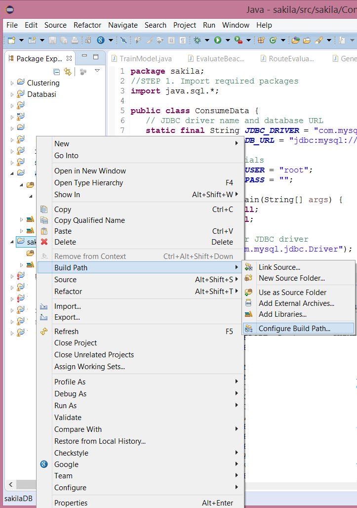

## Consuming data in Java


## Java Database Connectivity (JDBC)
* Java Database Connectivity (JDBC) is an application programming interface (API) for the programming language Java
  * defines how a client may access a database.
* Part of the Java Standard Edition platform from Oracle Corporation. 
* Provides methods to query and update data in a database, and is oriented towards relational databases 


## JDBC application 
* Tutorial on how to create a simple JDBC application (applies on sakila database)
  * How to open a database connection
  * Execute an SQL query
  * Display the results


## Building a JDBC application (1/2) 
* Import packages
  * Requires that you include the packages containing the JDBC classes needed for database programming. Most often, using import java.sql.* will suffice
* Register the JDBC driver
  * Requires that you initialize a driver so you can open a communication channel with the database
* Open a connection
  * Requires using the DriverManager.getConnection() method to create a Connection object, which represents a physical connection with the database


## Building a JDBC application (2/2) 
* Execute a query
  * Requires using an object of type Statement for building and submitting an SQL statement to the database
* Extract data from result set
  * Requires that you use the appropriateResultSet.getXXX() method to retrieve the data from the result set
* Clean up the environment
  * Requires explicitly closing all database resources versus relying on the JVM's garbage collection


## Sample Code (1/2)


## Sample Code (2/2)


## JDBC driver for MySQL
* Official driver for MySQL: MySQL Connector/J
* Available online: https://dev.mysql.com/downloads/connector/j/5.1.html
* Download: https://dev.mysql.com/downloads/file/?id=465644 
  * No login required. Just click “No thanks, just start download”


## Create new Java Project


## Create new Java Project


## Add Java class with the following code (1/3)
```java
package sakila;
//STEP 1. Import required packages
import java.sql.*;

public class ConsumeData {
   // JDBC driver name and database URL
   static final String JDBC_DRIVER = "com.mysql.jdbc.Driver";  
   static final String DB_URL = "jdbc:mysql://localhost/sakila";

   //  Database credentials
   static final String USER = "root";
   static final String PASS = "";
   
   public static void main(String[] args) {
   Connection conn = null;
   Statement stmt = null;
   try{
      //STEP 2: Register JDBC driver
      Class.forName("com.mysql.jdbc.Driver");

      //STEP 3: Open a connection
      System.out.println("Connecting to database...");
      conn = DriverManager.getConnection(DB_URL,USER,PASS);
```java


## Add Java class with the following code (2/3)
```java
//STEP 4: Execute a query
      System.out.println("Creating statement...");
      stmt = conn.createStatement();
      String sql;
      sql = "SELECT actor_id, first_name, last_name FROM actor";
      ResultSet rs = stmt.executeQuery(sql);

      //STEP 5: Extract data from result set
      while(rs.next()){
         //Retrieve by column name
         int actor_id  = rs.getInt("actor_id");
         String firstname = rs.getString("first_name");
         String lastname = rs.getString("last_name");

         //Display values
         System.out.print("ActorID: " + actor_id);
         System.out.print(", First name: " + firstname);
         System.out.println(", Last name: " + lastname);
      }
//STEP 6: Clean-up environment
      rs.close();
      stmt.close();
      conn.close();
   }catch(SQLException se){
```java


## Add Java class with the following code (3/3)
```java
//Handle errors for JDBC
      se.printStackTrace();
   }catch(Exception e){
      //Handle errors for Class.forName
      e.printStackTrace();
   }finally{
      //finally block used to close resources
      try{
         if(stmt!=null)
            stmt.close();
      }catch(SQLException se2){
      }// nothing we can do
      try{
         if(conn!=null)
            conn.close();
      }catch(SQLException se){
         se.printStackTrace();
      }//end finally try
   }//end try
   System.out.println("Finshed!");
}//end main
}//end FirstExample
```java


## Configure Build Path to add MySQL Connector/J driver



## Configure Build Path to add MySQL Connector/J driver


## Terminal output after executing the Java code
