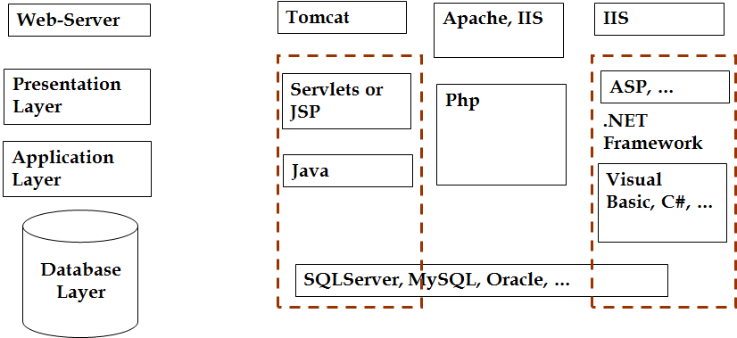
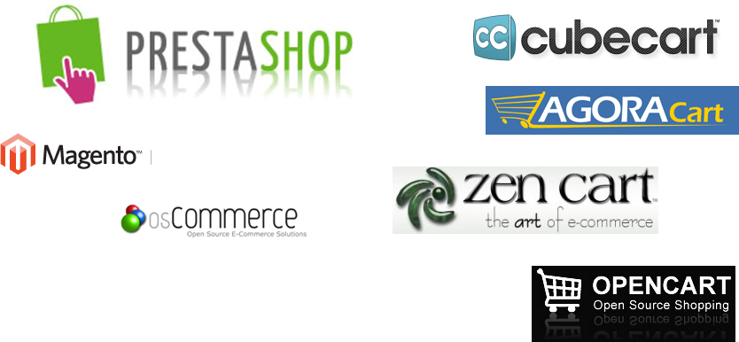
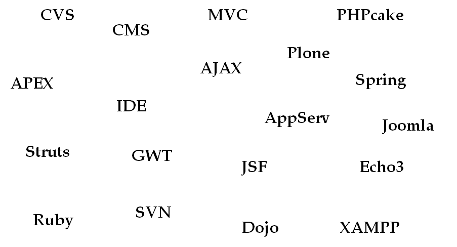

## Introduction to Software Development Tools
* Application Development Frameworks
* Content Management Systems (CMS)
* Popular Content management platforms
* Open source e-Commerce platforms
* Software development tools

## Application Development Frameworks

## Content Management Systems (CMS)
* A content management system, or CMS, is a web application designed to make it easy for non-technical users to add, edit and manage a website
* Automatically generate navigation elements
* Making content searchable and indexable
* Keeping track of users, their permissions and security settings
* and much, much more

## Popular Content management platforms

## Open source e-Commerce platforms

## Acronyms

## Software development tools
* IDE (Integrated development environment)
  * Netbeans
  * Eclipse 
  * .NET
* Version Repositories
  * CVS (Concurrent Versions System)
  * IDEs with CVS support: Emacs , Anjuta, Dev-C++, Eclipse, NetBeans, IntelliJ IDEA, wxDev-C++, Kdevelop, Aqualogic, Xcode, PhpED
* and many, many more

