## What is GitHub?

* GitHub is a web-based Git repository hosting service. It offers all of the distributed version control and source code management (SCM) functionality. It provides access control and several collaboration features such as bug tracking, feature requests, task management, and wikis for every project. For more info see [here](https://en.wikipedia.org/wiki/GitHub).

## Why to use GitHub on Bootcamp?

* You are going to upload and edit your excercises on your personal GitHub page.

## Sign up

## Create your profile I

* Select the free repositories option and then press Continue

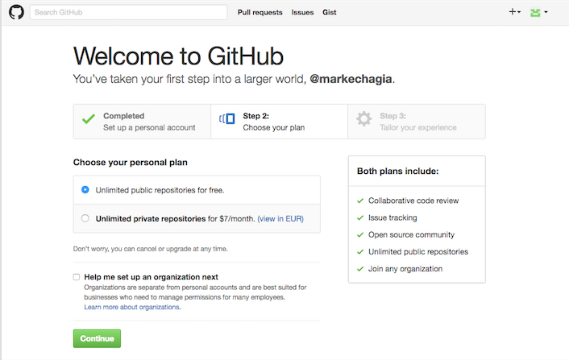

## Create your profile II

* Answer if you want or skip this page for now 

## Create your profile III

* Press start a project

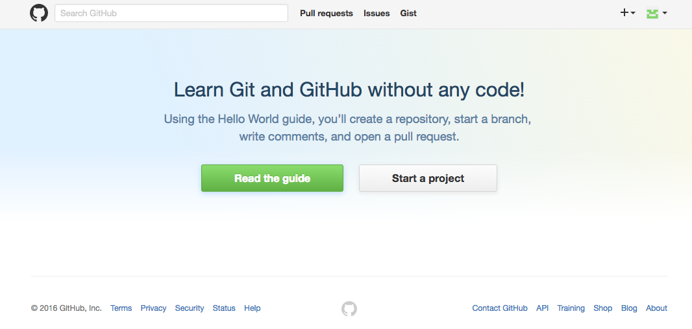

## Create your profile IV

* Check your inbox and verify your email address

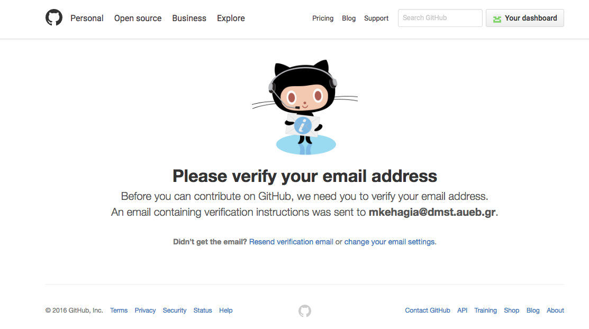

## Create a repo I

* Give a name to your repo
* Write a description for your repo
* Select to be public
* Select to initialize the repo with a README file

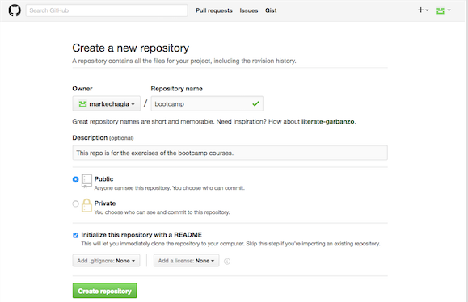

## Create a repo II

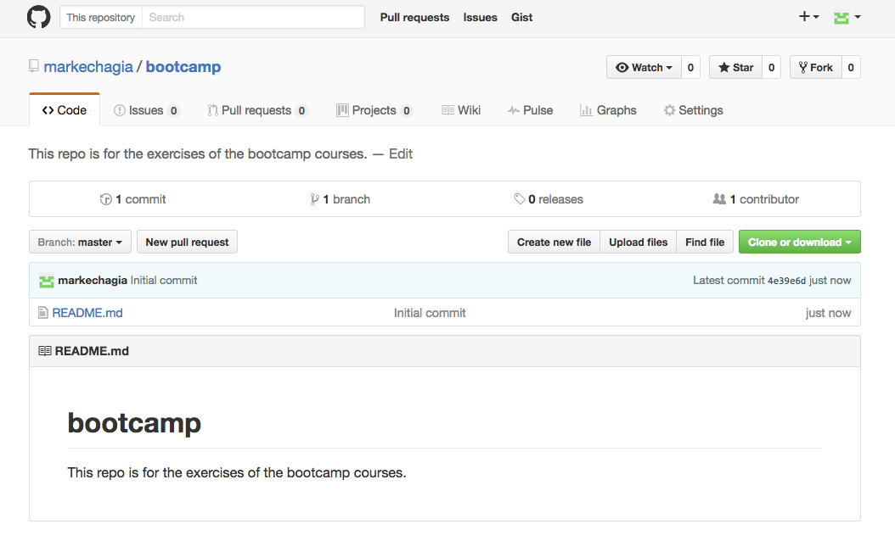

## Add a new file to the repo I

* Select to upload a new file
* Drag and drop your file

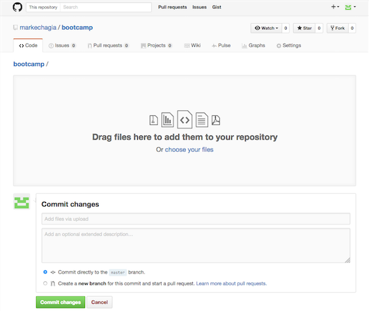

## Add a new file to the repo II

* After you drop the file commit your changes
* Write a message and press commit

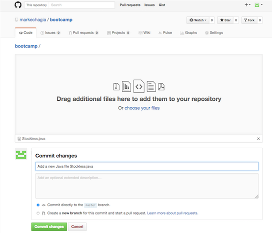

## Add a new file to the repo III

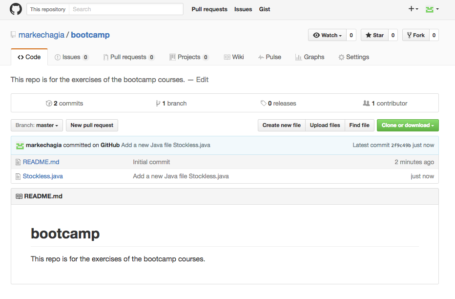

## Edit a file I

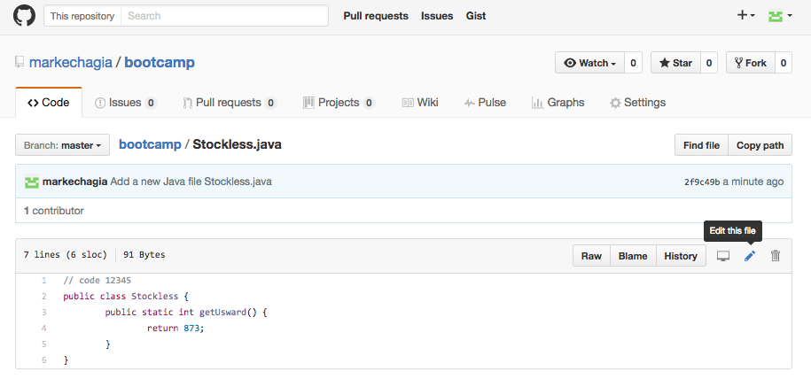

## Edit a file II

* Make and commit your changes

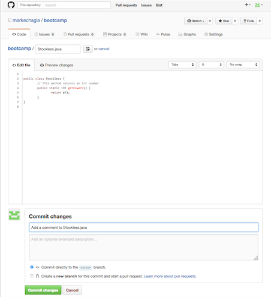

## Repo files

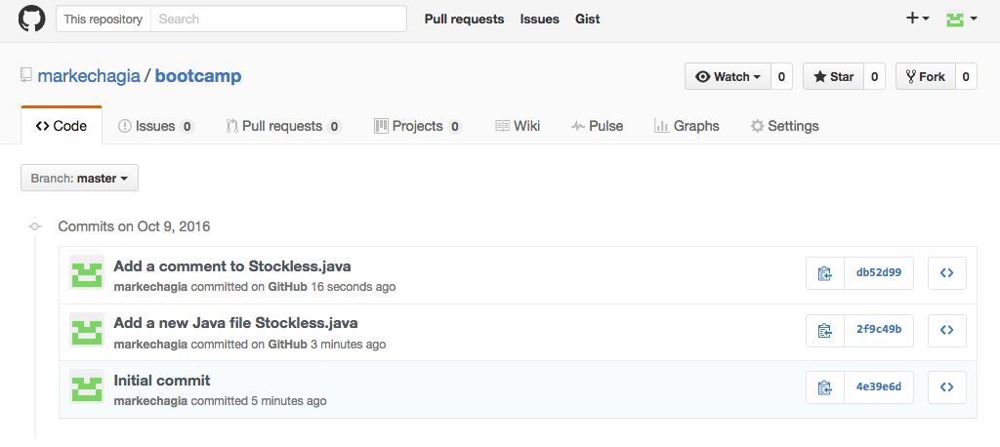