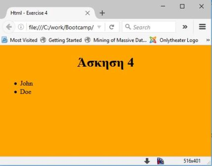
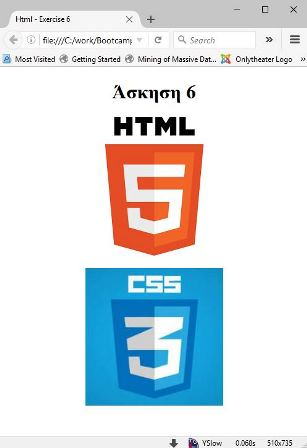
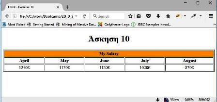
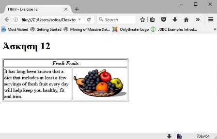
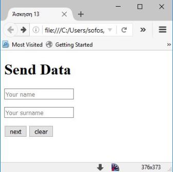
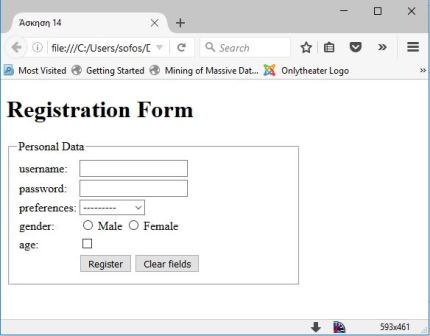
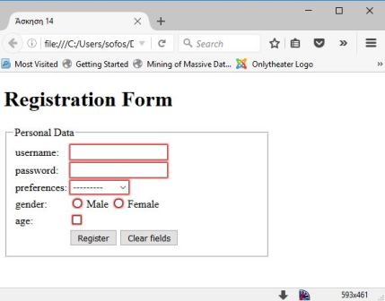

### Coding Bootcamp

## Introduction to HTML


## Άσκηση 1
** Δημιουργήστε μια σελίδα Html ως εξής: **
* Όταν εκτελείται το παράθυρο στον browser θα έχει τίτλο: Coding Bootcamp: Html - Exercise 1
* Η σελίδα θα έχει τίτλο (Επικεφαλίδα) το όνοματεπώνυμό σας (στα Ελληνικά) και από κάτω θα υπάρχει παράγραφος με το παρακάτω κείμενο:
```
Lorem ipsum dolor sit amet, consectetuer adipiscing elit.
```
* Οι λέξεις **Lorem** και **consectetuer** θα είναι με έντονη γραφή (bold), ενώ η λέξη **dolore** θα είναι με έντονη και πλάγια (bold και italic).


## Άσκηση 2
** Δημιουργήστε μια σελίδα Html ως εξής: **
* Όταν εκτελείται το παράθυρο στον browser θα έχει τίτλο: Html - Exercise 2
* Η σελίδα θα έχει τίτλο (Επικεφαλίδα): **Άσκηση 2** και από κάτω θα υπάρχει μια οριζόντια γραμμή και 2 παράγραφοι όπως το παρακάτω σχήμα:


## Άσκηση 3
** Δημιουργήστε μια σελίδα Html ως εξής: **
* Όταν εκτελείται το παράθυρο στον browser θα έχει τίτλο: Html - Exercise 3
* Η σελίδα θα έχει τίτλο (Επικεφαλίδα): **Άσκηση 3** στοιχισμένo στο κέντρο, με μπλε γράμματα και σε κίτρινο φόντο. Από κάτω υπάρχει μια οριζόντια γραμμή και 2 παράγραφοι με μορφοποίηση όπως το παρακάτω σχήμα:


## Άσκηση 4
** Δημιουργήστε μια σελίδα Html ως εξής: **
* Η σελίδα θα έχει χρώμα πορτοκαλί και τίτλο (Επικεφαλίδα): **Άσκηση 4** στοιχισμένo στο κέντρο, από κάτω μη διατεταγμένη λίστα με το όνομα και το επώνυμό σας.




## Άσκηση 5
* Δημιουργήστε μια σελίδα Html όπως στο παρακάτω σχήμα:


## Άσκηση 6
* Κατεβάστε τις εικόνες: [εικόνα1](media/html5.png) και [εικόνα2](media/css3.jpg) και δημιουργήστε μια σελίδα Html όπως στο παρακάτω σχήμα:




## Άσκηση 7
* Δημιουργήστε 2 σελίδες Html, η πρώτη θα έχει τίτλο HTML και η δεύτερη CSS. Οι τίτλοι θα είναι σύνδεσμοι που θα οδηγούν από την μια σελίδα στην άλλη. 


## Άσκηση 8
* Δημιουργήστε 2 σελίδες Html, η πρώτη θα έχει τίτλο HTML και η δεύτερη CSS. Η κάθε σελίδα θα έχει την αντίστοιχη εικόνα (Άσκηση 6)  και θα είναι σύνδεσμοι που θα οδηγούν από την μια σελίδα στην άλλη.   


## Άσκηση 9
* Δημιουργήστε μια σελίδα Html όπως στο παρακάτω σχήμα:


```
Τα Chapter 1, Chapter 1 και Go to top είναι σύνδεσμοι
 εσωτερικά στην σελίδα.
```


## Άσκηση 10
* Δημιουργήστε μια σελίδα Html όπως στο παρακάτω σχήμα:




## Άσκηση 11
* Κατεβάστε την εικόνα [John Doe](media/jdoe.jpg) και δημιουργήστε μια σελίδα Html όπως στο παρακάτω [σχήμα](media/html_exercise_11.jpg)


## Άσκηση 12
* Κατεβάστε την εικόνα [fruitbowl.gif](media/fruitbowl.gif) και δημιουργήστε μια σελίδα Html όπως στο παρακάτω σχήμα:




## Άσκηση 13
* Δημιουργήστε μια σελίδα Html όπως στο παρακάτω σχήμα:



```
Σημείωση: Εάν ο χρήστης δεν συμπληρώσει όλα τα πεδία τηε φόρμας
 τότε δεν θα πρέπει να του επιτρέπει να υποβάλλει την φόρμα
```


## Άσκηση 14
* Δημιουργήστε μια σελίδα Html όπως στο παρακάτω σχήμα (αριστερά):

 

```
- Εάν ο χρήστης δεν συμπληρώσει όλα τα πεδία τηε φόρμας  τότε δεν 
  θα πρέπει να του επιτρέπει να υποβάλλει την φόρμα (Σχήμα δεξιά)
- Η φόρμα έχει μήκος 400 pixels
```