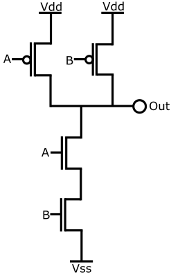
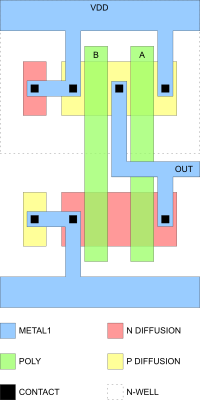
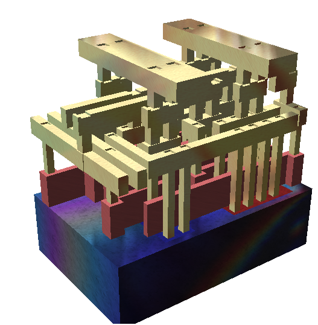
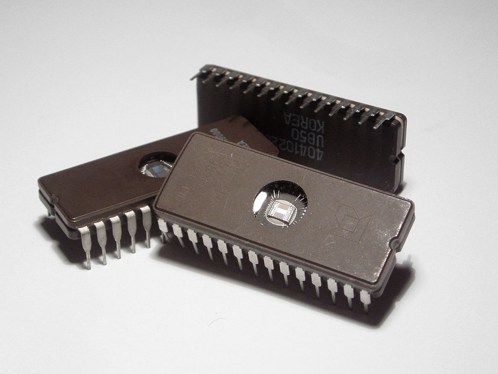
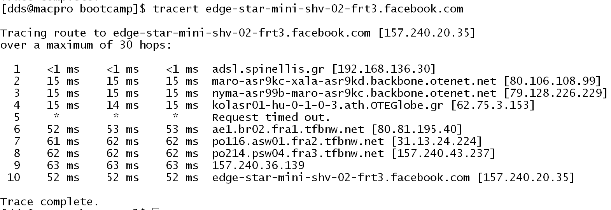

## Transistors and gates
* Transistor: a miniature switch
* Logic gate: digital building block

## A NAND gate as transistors

[By JustinForce - Own work, CC BY-SA 3.0](https://commons.wikimedia.org/w/index.php?curid=2593317)

## Digits and counting
* Counting with 0 and 1
* How to add two bits
* How to add three bits
* How to add 64 bits with 64 bits

## A four bit ALU

[By Poil - Own work, CC BY-SA 3.0](https://commons.wikimedia.org/wiki/File:74181aluschematic.png)

## Information representation: positive integers
* 0000: 0
* 0001: 1
* 0010: 2
* 0011: 3
* 0100: 4
* 0101: 5
* 0110: 6
* 0111: 7

## Information representation: negative integers
* 1111: -1
* 1110: -2
* 1101: -3
* 1100: -4
* 1011: -5
* 1010: -6
* 1001: -7
* 1000: -8

## Information representation: letters
* 00100001: !
* 00111111: ?
* 00110000: 0
* 00111001: 9
* 01000001: A
* 01000010: B
* 01011010: Z
* 01100001: a
* 01100011: b
* 01111010: z

## Information representation: floating point numbers
* 1:   0 01111111 [1]00000000000000000000000
  * 1 × 1 × 2127 - 127
* 2:   0 10000000 [1]00000000000000000000000
  * 1 × 1 × 2128 - 127
* 3:   0 10000000 [1]10000000000000000000000
  * 1 × 3 × 2128 - 127
* -1:  1 01111111 [1]00000000000000000000000
  * -1 × 1 × 2127 - 127

## Information representation: floating point numbers
* 1.5: 0 01111111 [1]10000000000000000000000
  * 1 × 1.5 × 2127 - 127
* 1.1: 0 01111111 [1]00011001100110011001101
  * 1 × 1.100000023841858 × 2127 - 127
  * 1.10000002384185791015625
* 2 × 1030: 0 11100011 10010011111001011001010
  * 1 × 1.5777218341827393 × 2227 - 127
  * 2000000030094932439753377710080

## Chips and chip contruction
* Gates are put together in integrated circuits
* Chips can serve various functions, such as CPU, memory, or interface
* Early ICs contained 2-6 gates (8-30 transistors)
* A modern CPU can contain 20 billion transistors

## A NAND gate in CMOS

[By Jamesm76 at English Wikipedia, Public Domain](https://commons.wikimedia.org/w/index.php?curid=2944072)

## Structure of a chip

[By Cepheiden - self made, CC BY 2.5](https://commons.wikimedia.org/w/index.php?curid=1445444)

## A gate in three dimensions

[By David Carron at English Wikipedia, Public Domain](https://commons.wikimedia.org/w/index.php?curid=3699071)

## A chip in a DIL package

[By Zephyris at English Wikipedia - CC BY-SA 3.0](https://commons.wikimedia.org/w/index.php?curid=4560427)

## A peek through the window

[By Zephyris at English Wikipedia - CC BY-SA 3.0](https://commons.wikimedia.org/w/index.php?curid=17139158)

## Flash memory through electron microscopy

By Micron Technology Inc.

## Inside a modern computer
* CPU
* RAM
* Secondary storage (magnetic disk, SSD)
* ROM
* Interfaces
  * USB
  * DMA
  * Networking
  * Graphics

## Low-level programming
* Registers
* Arithmetic instructions
* Control flow
* Memory access
* Stack

## High-level programming
* Compiling expressions into instructions
* Interpreting instructions
* Tokens
  * Constants
  * Operators
  * Reserved words
  * Comments
* Syntax

## Commonly used programming languages
* C
* C++, Go, Rust
* Java, C#, Swift
* JavaScript, PHP
* Python, Ruby, Perl

## Memory organization
* Code
* Stack
* Heap
* Constants

## Operating system
* Process isolation
* Device virtualization
* Multitasking
* Application host
* System calls (API)

## Network layers
* Application
* Presentation
* Session
* Transport
* Network
* Link
* Physical

## Building the web
* HTML
* HTTP
* DNS
* TCP
* IP

## Anatomy of a captured network packet

## A trace of a packet's route

## Serving requests
* Data centers
* Load balancing
* Application servers
* Databases
* Microservices
