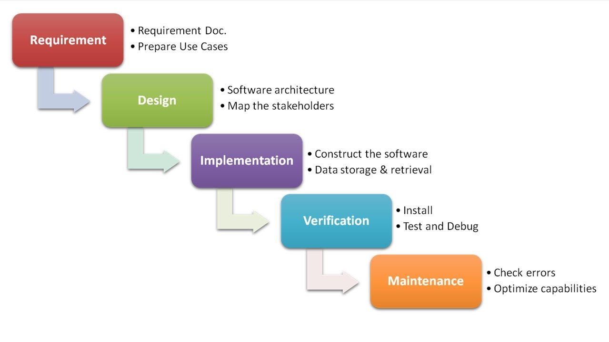
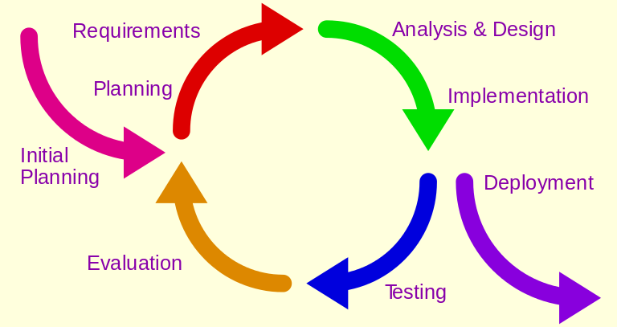
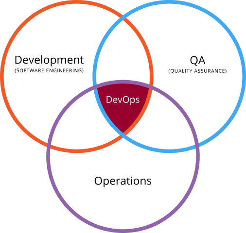

## Software development process - core activities
* Requirements capturing (also called _Requirements analysis_)
* Design 
* Construction (also called _Software implementation_) 
* Software Testing and Debugging 
* Deployment 
* Maintenance

## Methodologies, paradigms and models
* Software engineering 
* Waterfall 
* Prototyping 
* Incremental 
* V-Model, Dual Vee Model 
* Spiral
* Iterative and incremental development (IID) 
* Agile (2001)
* Lean (2003)
* DevOps (2008)

## Software engineering
Software engineering is the application of engineering to the design, development, implementation, testing and maintenance of software in a systematic method

## Waterfall

## Prototyping
Software prototyping is the activity of creating prototypes of software applications, i.e., incomplete versions of the software program being developed

## Spiral

[Spiral_model_(Boehm,_1988)](http://commons.wikimedia.org/wiki/File:Spiral_model_(Boehm,_1988).png)

## Iterative and incremental development (IID) 

[Iterative development model](https://commons.wikimedia.org/w/index.php?curid=34159246)

## Agile (2001)
* Agile software development describes a set of principles for software development under which requirements and solutions evolve through the collaborative effort of self-organizing cross-functional teams
* First coined in 2001, in the Manifesto for Agile Software Development 

## Lean (2003)
* Lean software development (LSD) is a translation of lean manufacturing and lean IT principles and practices to the software development domain
* Adapted from the Toyota Production System, it emerged from within the Agile community

## 	Lean principles
* Eliminate waste
* Amplify learning
* Decide as late as possible
* Deliver as fast as possible
* Empower the team
* Build integrity in
* See the whole

## DevOps
DevOps (a clipped compound of development and operations) is a culture, movement or practice that emphasizes the collaboration and communication of both software developers and other information-technology (IT) professionals while automating the process of software delivery and infrastructure changes

## DevOps

[DevOps](https://commons.wikimedia.org/w/index.php?curid=20202905)

## Scrum
* Scrum is an iterative and incremental agile software development framework for managing product development
* It defines "a flexible, holistic product development strategy where a development team works as a unit to reach a common goal"
* It challenges assumptions of the "traditional, sequential approach" to product development
* It enables teams to self-organize by encouraging physical co-location or close online collaboration of all team members, as well as daily face-to-face communication among all team members and disciplines involved

##Supporting disciplines
* Configuration management 
* Documentation 
* Software Quality assurance (SQA) 
* Project management 
* User experience

##Tools
* Compiler 
* Debugger 
* Profiler 
* GUI designer 
* Modeling 
* IDE 
* Build automation 
* Release automation 
* Testing